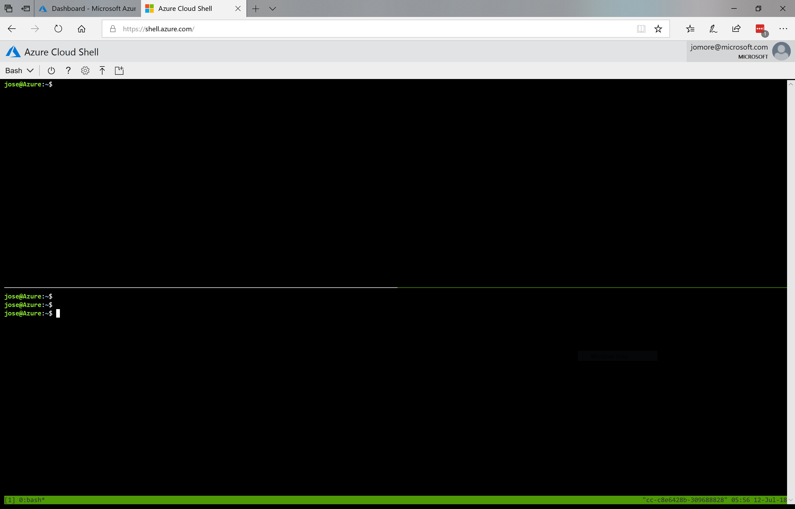
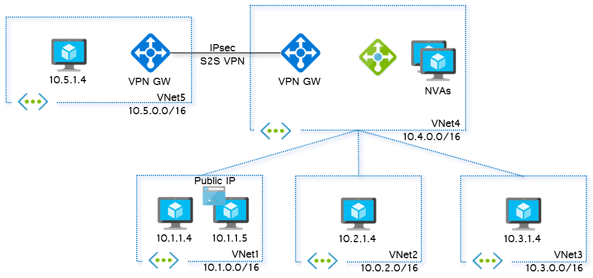
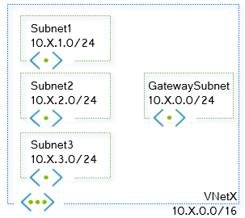
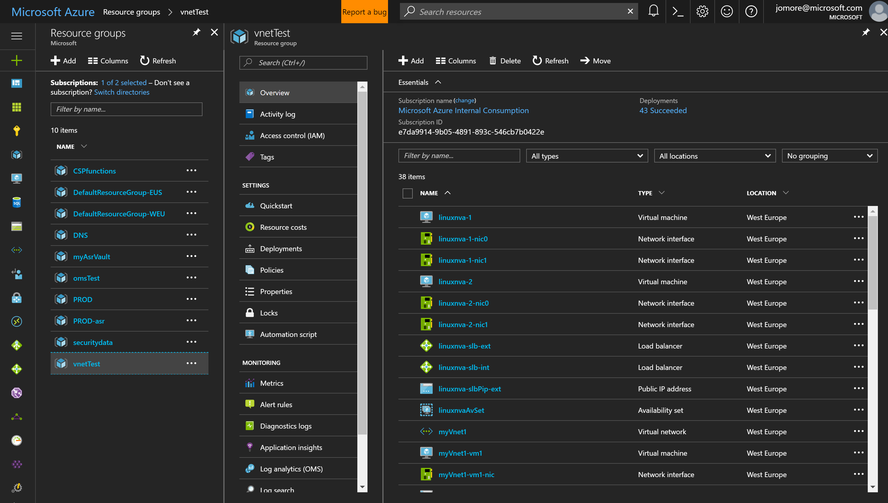
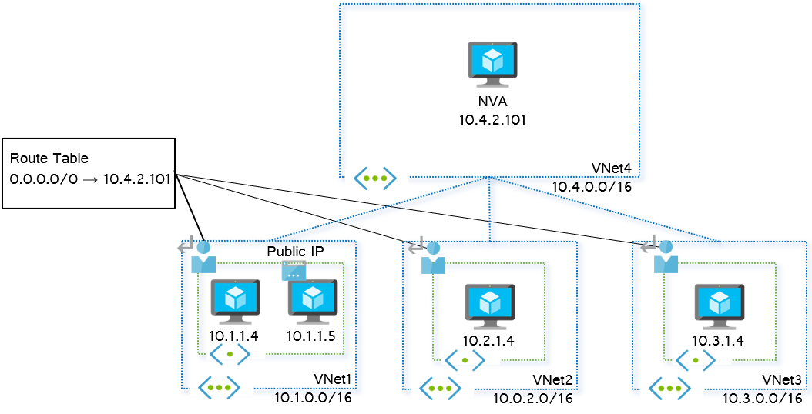
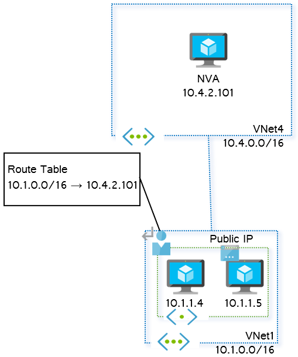
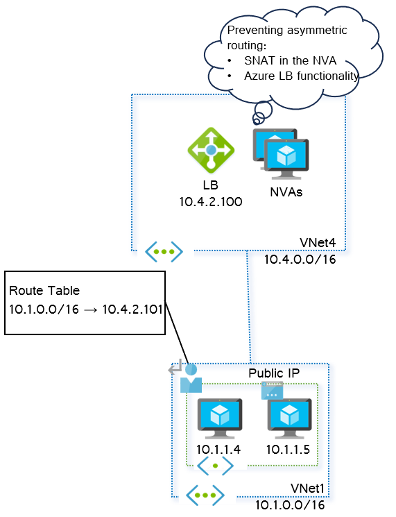
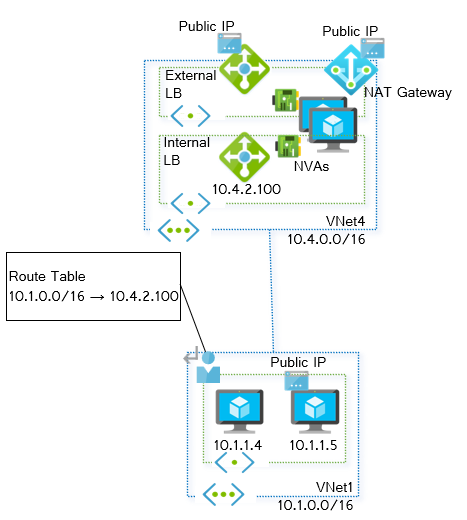
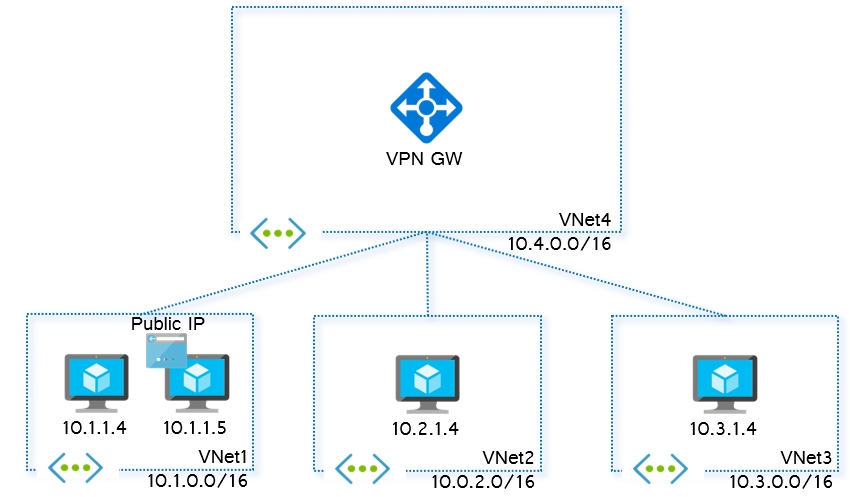

# Azure Networking Lab

# Table of Contents

[Objectives and initial setup](#objectives)

[Introduction to Azure Networking](#intro)

**[Part 0: First steps](#part0)**

- [Lab 0: Initialize Environment](#lab0)

- [Lab 1: Explore Lab environment](#lab1)

**[Part 1: Spoke-to-Spoke communication over NVA](#part1)**

- [Lab 2: Spoke-to-Spoke communication over NVA](#lab2)

- [Lab 3: Microsegmentation with NVA](#lab3)

**[Part 2: NVA Scalability and HA](#part2)**

- [Lab 4: NVA Scalability](#lab4)

- [Lab 5: Using the Azure LB for return traffic](#lab5)

- [Lab 6: Outbound Internet traffic protected by the NVA](#lab6)

- [Lab 7: Advanced HTTP-based probes](#lab7)

- [Lab 8: NVAs in a VMSS](#lab8)

**[Part 3: VPN gateway](#part3)**

- [Lab 9: Spoke-to-Spoke communication over the VPN gateway](#lab9)

- [Lab 10: VPN connection to the Hub Vnet](#lab10)

[End the lab](#end)

[Conclusion](#conclusion)

[References](#ref)


# Objectives and initial setup <a name="objectives"></a>

This document contains a lab guide that helps to deploy a basic environment in Azure that allows to test some of the functionality of the integration between Azure and Ansible.
Before starting with this account, make sure to fulfill all the requisites:
-	A valid Azure subscription account. If you don’t have one, you can create your free azure account (https://azure.microsoft.com/free/) today.
-	If you are using Windows 10/11, you can install the Windows Subsystem for Linux ([How to install Linux on Windows with WSL](https://learn.microsoft.com/windows/wsl/install)).
-	Azure CLI 2.0, follow these instructions to install: [https://docs.microsoft.com/cli/azure/install-azure-cli](https://docs.microsoft.com/cli/azure/install-azure-cli)

The labs cover: 
-	Introduction to Azure networking
-	Deployment of multi-vnet Hub and Spoke design
-	Traffic filtering in Azure with firewalls
-	Microsegmentation using firewalls
-	Scaling out NVAs with load balancing and SNAT
-	Advanced probes for Azure Load Balancers
-	Linux custom routing

This lab has been modified to improve the user's experience. Testing with Virtual Network Gateways has been taken all the way to the end, since just the gateway deployment can take up to 45 minutes. The activities in this lab have been divided in 3 sections:

-	Section 1: Hub and Spoke networking (around 60 minutes)
-	Section 2: NVA scalability with Azure Load Balancer (around 90 minutes)
-	Section 3: using VPN gateway for spoke-to-spoke connectivity and site-to-site access (around 60 minutes, not including the time required to provision the gateways)

Along this lab some variables will be used, that might (and probably should) look different in your environment. These are the variables you need to decide on before starting with the lab. Notice that the VM names are prefixed by a (not so) random number, since these names will be used to create DNS entries as well, and DNS names need to be unique.

| **Description** | **Value used in this lab guide** |
| --- | --- |
| Azure resource group | vnetTest |
| Username for provisioned VMs and NVAs | lab-user |
| Password for provisioned VMs and NVAs | Microsoft123! |
| Azure region | westeurope |


As tip, if you want to do the VPN lab, it might be beneficial to run the commands in [Lab9](#lab9) Step1 as you are doing the previous labs, so that you don’t need to wait for 45 minutes (that is more or less the time it takes to provision VPN gateways) when you arrive to [Lab9](#lab9).
 
## Introduction to Azure Networking <a name="intro"></a>

Microsoft Azure has established as one of the leading cloud providers, and part of Azure's offering is Infrastructure as a Service (IaaS), that is, provisioning raw data center infrastructure constructs (virtual machines, networks, storage, etc), so that any application can be installed on top.

An important part of this infrastructure is the network, and Microsoft Azure offers multiple network technologies that can help to achieve the applications' business objectives: from VPN gateways that offer secure network access to load balancers that enable application (and network, as we will see in this lab) scalability.

Some organizations have decided to complement Azure Network offering with Network Virtual Appliances (NVAs) from traditional network vendors. This lab will focus on the integration of these NVAs, and we will take as example an open source firewall, that will be implemented with iptables running on top of an Ubuntu VM with 2 network interfaces. This will allow to highlight some of the challenges of the integration of this sort of VMs, and how to solve them.

At the end of this guide you will find a collection of useful links, but if you don’t know where to start, here is the home page for the documentation for Microsoft Azure Networking: https://docs.microsoft.com/azure/#pivot=services&panel=network.

The second link you want to be looking at is this document, where Hub and Spoke topologies are discussed: https://docs.microsoft.com/azure/architecture/reference-architectures/hybrid-networking/hub-spoke. 

If you find any issue when running through this lab or any error in this guide, please open a Github issue in this repository, and we will try to fix it. Enjoy!
 
# Part 0: First steps <a name="part0"></a>

## Lab 0: Initialize Azure Environment <a name="lab0"></a>

**Step 1.** Log into your system.

**Step 2.** If you don’t have a valid Azure subscription, you can create a free Azure subscription in https://azure.microsoft.com/free. If you have received a voucher code for Azure, go to https://www.microsoftazurepass.com/Home/HowTo for instructions on how to redeem it.  

**Step 3.** Open a terminal window and log into Azure. Here you have different options:

* If you are using the Azure CLI on Windows, you can press the Windows key in your keyboard, then type `cmd` and hit the Enter key. You might want to maximize the command Window so that it fills your desktop.

* If you are using the Azure CLI on the Linux subsystem for Windows, open your Linux console

* If you are using Linux or Mac, you probably do not need me to tell me how to open a Terminal window

* Alternatively you can use the Azure shell, no matter on which OS you are working. Open the URL [https://shell.azure.com](https://shell.azure.com) on a Web browser, and after authenticating with your Azure credentials you will get to an Azure Cloud Shell. In this lab we will use the Azure CLI (and not Powershell), so make sure you select the Bash shell. You can optionally use `tmux`, as this figure shows:  



**Figure 1.** Cloud shell with two tmux panels

If not using cloud shell, you will have to log into Azure. You can copy the following command from this guide with Ctrl-C, and paste it into your terminal window:

```bash
az login
```

After logging into Azure, you should be able to retrieve details from the current subscription:

```bash
az account show
```

If you have multiple subscriptions and the wrong one is being selected, you can select the subscription where you want to deploy the lab with the command `az account set --subscription <your subscription GUID>`.

**Step 4.** Create a new resource group, where we will place all our objects (so that you can easily delete everything after you are done). The last command also sets the default resource group to the newly created one, so that you do not need to download it. Note that your **regions should support Availability Zones**, otherwise the ARM template will not deploy successfully.

```bash
# Set some variables (bash)
rg=vnetTest
location=eastus2
location2ary=westus
adminPassword='Microsoft123!'
template_uri=https://raw.githubusercontent.com/erjosito/azure-networking-lab/master/arm/NetworkingLab_master.json
```

For Windows Powershell, this is how you would declare variables:

```powershell
# Set some variables (PowerShell)
$rg = "vnetTest"
$location = "eastus2"
$location2ary = "westus"
$adminPassword = "Microsoft123!"
$template_uri = "https://raw.githubusercontent.com/erjosito/azure-networking-lab/master/arm/NetworkingLab_master.json"
```

Now you can create the resource group:

```
az group create --name $rg --location $location
az configure --defaults group=$rg
```

**Step 5.** Deploy the master template that will create our initial network configuration:

```bash
az deployment group create --name netLabDeployment --template-uri $template_uri --resource-group $rg --parameters "{\"adminPassword\":{\"value\":\"$adminPassword\"}, \"location2ary\":{\"value\": \"$location2ary\"}, \"location2aryVnets\":{\"value\": [3]}}" 
```

**Note**: the previous command will deploy 5 vnets, one of them (vnet 3) in an alternate location. The goal of deploying this single vnet in a different location is to include **global vnet peering** in this lab. Should you not have access to locations where global vnet peering is available (such as West Europe and West US 2 used in the examples), you can just deploy the previous templates without the parameters `location2ary` and `location2aryVnets`, which will deploy all nets into the same location as the resource group.


**Step 6.** Since the previous command will take a while (around 15 minutes), open another command window (see Step 3 for detailed instructions) to monitor the deployment progress. Note you might have to login in this second window too:

```bash
az deployment group list -o table
```

The output of that command should be something like this:

```
Name               Timestamp                         State
-----------------  --------------------------------  ---------
myVnet5gwPip       2017-06-29T19:15:28.227920+00:00  Succeeded
myVnet4gwPip       2017-06-29T19:15:31.617920+00:00  Succeeded
myVnet5-vm1-nic    2017-06-29T19:15:38.468886+00:00  Succeeded
myVnet1VpnGw       2017-06-29T19:15:38.565418+00:00  Succeeded
myVnet5VpnGw       2017-06-29T19:15:39.056567+00:00  Succeeded
myVnet3-vm1-nic    2017-06-29T19:15:39.269138+00:00  Succeeded
myVnet4-vm1-nic    2017-06-29T19:15:39.509990+00:00  Succeeded
myVnet2VpnGw       2017-06-29T19:15:40.576390+00:00  Succeeded
myVnet2-vm1-nic    2017-06-29T19:15:41.003741+00:00  Succeeded
myVnet1-vm1-nic    2017-06-29T19:15:41.143406+00:00  Succeeded
myVnet4VpnGw       2017-06-29T19:15:42.608290+00:00  Succeeded
myVnet3VpnGw       2017-06-29T19:15:44.467581+00:00  Succeeded
myVnet3-vm         2017-06-29T19:20:21.195625+00:00  Succeeded
myVnet4-vm         2017-06-29T19:20:21.856738+00:00  Succeeded
myVnet5-vm         2017-06-29T19:20:38.720152+00:00  Succeeded
myVnet-template-3  2017-06-29T19:20:42.269630+00:00  Succeeded
myVnet-template-4  2017-06-29T19:20:42.581238+00:00  Succeeded
myVnet1-vm         2017-06-29T19:20:42.663423+00:00  Succeeded
myVnet-template-5  2017-06-29T19:20:55.790429+00:00  Succeeded
myVnet-template-1  2017-06-29T19:20:59.148149+00:00  Succeeded
myVnet2-vm         2017-06-29T19:21:11.406220+00:00  Succeeded
myVnet-template-2  2017-06-29T19:21:29.787517+00:00  Succeeded
vnets              2017-06-29T19:21:32.490251+00:00  Succeeded
vnet5Gw            2017-06-29T19:21:52.630513+00:00  Succeeded
vnet4Gw            2017-06-29T19:21:53.090784+00:00  Succeeded
linuxnva-1-nic0    2017-06-29T19:21:56.417810+00:00  Succeeded
UDRs               2017-06-29T19:21:57.487004+00:00  Succeeded
linuxnva-2-nic0    2017-06-29T19:21:58.322935+00:00  Succeeded
myVnet1-vm2-nic    2017-06-29T19:21:58.354766+00:00  Succeeded
linuxnva-2-nic1    2017-06-29T19:21:59.328610+00:00  Succeeded
linuxnva-1-nic1    2017-06-29T19:21:59.490821+00:00  Succeeded
nva-slb-int        2017-06-29T19:22:03.146781+00:00  Succeeded
hub2spoke2         2017-06-29T19:22:09.140223+00:00  Succeeded
hub2spoke3         2017-06-29T19:22:10.229240+00:00  Succeeded
hub2spoke1         2017-06-29T19:22:12.980700+00:00  Succeeded
AzureLB            2017-06-29T19:22:15.587843+00:00  Succeeded
nva-slb-ext        2017-06-29T19:22:18.507575+00:00  Succeeded
vnet1subnet1vm2    2017-06-29T19:26:53.109076+00:00  Succeeded
nva                2017-06-29T19:29:24.679832+00:00  Succeeded
netLabDeployment   2017-06-29T19:29:26.491546+00:00  Succeeded
```

**Note:** You might see other resource names when using your template, since newer lab versions might have different object names

## Lab 1: Explore the Azure environment <a name="lab1"></a> 

**Step 1.** You don’t need to wait until all objects in the template have been successfully deployed (although it would be good, to make sure that everything is there). In your second terminal window, start exploring the objects created by the ARM template: vnets, subnets, VMs, interfaces, public IP addresses, etc. Save the output of these commands (copying and pasting to a text file for example).

You can see some diagrams about the deployed environment here, so that you can interpret better the command outputs.

Note that the output of these commands might be different, if the template deployment from lab 0 is not completed yet.


 
**Figure 2.** Overall vnet diagram



**Figure 3.** Subnet design of every vnet

<pre lang="bash">
<b>az network vnet list -g $rg -o table</b>
Location    Name     ProvisioningState    ResourceGroup    ResourceGuid
----------  -------  -------------------  ---------------  -------------
westeurope  myVnet1  Succeeded            vnetTest         1d20ba9a... 
westeurope  myVnet2  Succeeded            vnetTest         43ca80d0...
westus2     myVnet3  Succeeded            vnetTest         4837a481...
westeurope  myVnet4  Succeeded            vnetTest         72a82a72...
westeurope  myVnet5  Succeeded            vnetTest         96e5f9c5...      
</pre>

**Note:** Some columns of the ouput above have been removed for clarity purposes.

<pre lang="bash">
<b>az network vnet subnet list -g $rg --vnet-name myVnet1 -o table</b>
AddressPrefix    Name            ProvisioningState    ResourceGroup
---------------  --------------  -------------------  ---------------
10.1.0.0/24      GatewaySubnet   Succeeded            vnetTest
10.1.1.0/24      myVnet1Subnet1  Succeeded            vnetTest
10.1.2.0/24      myVnet1Subnet2  Succeeded            vnetTest
10.1.3.0/24      myVnet1Subnet3  Succeeded            vnetTest
</pre>

<pre lang="bash">
<b>az vm list -g $rg -o table</b>
Name         ResourceGroup    Location
-----------  ---------------  ----------
linuxnva-1   vnetTest         westeurope
linuxnva-2   vnetTest         westeurope
myVnet1-vm1  vnetTest         westeurope
myVnet1-vm2  vnetTest         westeurope
myVnet2-vm1  vnetTest         westeurope
myVnet3-vm1  vnetTest         westeurope
myVnet4-vm1  vnetTest         westeurope
myVnet5-vm1  vnetTest         westeurope
</pre>

<pre lang="bash">
<b>az network nic list -g $rg -o table</b>
EnableIpForwarding    Location    MacAddress         Name
--------------------  ----------  -----------------  -------
True                  westeurope  00-0D-3A-28-F8-F9  linuxnva-1-nic0  
True                  westeurope  00-0D-3A-28-F0-3A  linuxnva-1-nic1  
True                  westeurope  00-0D-3A-28-24-73  linuxnva-2-nic0  
True                  westeurope  00-0D-3A-28-2A-28  linuxnva-2-nic1
                      westeurope  00-0D-3A-2A-48-AF  myVnet1-vm1-nic
                      westeurope  00-0D-3A-28-2C-8C  myVnet1-vm2-nic
                      westeurope  00-0D-3A-2A-4A-DE  myVnet2-vm1-nic
                      westus2     00-0D-3A-2A-46-DE  myVnet3-vm1-nic
                      westeurope  00-0D-3A-2A-4F-EA  myVnet4-vm1-nic
                      westeurope  00-0D-3A-2A-47-BC  myVnet5-vm1-nic      
</pre>

**Note:** Some columns of the ouput above have been removed for clarity purposes.


<pre lang="bash">
<b>az network public-ip list -g $rg --query '[].[name,ipAddress]' -o table</b>
Column1              Column2
-------------------  ---------------
linuxnva-slbPip-ext  5.6.7.8
myVnet1-vm2-pip      1.2.3.4
vnet4gwPip
vnet5gwPip
</pre>

**Note:** You might have notice the `--query` option in the command above. The reason is that the standard command to list public IP addresses does not show the IP addresses themselves, interestingly enough. With the --query option you can force the Azure CLI to show the information you are interested in. Furthermore, the public IP addresses in the table are obviously not the ones you will see in your environment.

As you see, we have a single public IP address allocated to `myVnet1-vm2`. We will use this VM as jump host for the lab.

**Step 2.** Using the public IP address from the previous step open an SSH terminal (putty on windows, an additional terminal on Mac/Linux, a new tmux panel in the cloud shell, etc) and connect to the jump host. If you did not modified the ARM templates used to provision the environment, the user is lab-user, and the password Microsoft123!

<pre lang="bash">
<b>ssh lab-user@1.2.3.4</b>
The authenticity of host '1.2.3.4 (1.2.3.4)' can't be established.
ECDSA key fingerprint is SHA256:FghxuVL+BuKux27Homrsm3nYjb7o/gE/SfFoiRYl5Y4.
Are you sure you want to continue connecting (yes/no)? yes
Warning: Permanently added '1.2.3.4' (ECDSA) to the list of known hosts.
lab-user@1.2.3.4's password:
<i>[... ouput omitted...]</i>
lab-user@myVnet1-vm2:~$
</pre>

**Note:** do not forget to use the actual public IP address of your environment instead of the sample value of `1.2.3.4`. Make sure to use the IP address corresponding to `myVnet1-vm2-pip`, not the one assigned to `linuxnva-slbPip-ext`.

**Step 3.** Connect to the Azure portal (http://portal.azure.com) and locate the resource group that we have just created (called &#39;vnetTest&#39;, if you did not change it). Verify the objects that have been created and explore their properties and states.




**Figure 5:** Azure portal with the resource group created for this lab

**Note:** you might want to open two new additional command prompt windows (or tmux panels) and launch the two commands from Lab 8, Step 1. Each of those commands (can be run in parallel) will take around 45 minutes, so you can leave them running while you proceed with Labs 2 through 7. If you are not planning to run Labs 8-9, you can safely ignore this paragraph.


# PART 1: Hub and Spoke Networking <a name="part1"></a>
 
## Lab 2: Spoke-to-Spoke Communication over an NVA <a name="lab2"></a>

In some situations you would want some kind of security between the different Vnets. Although this security can be partially provided by Network Security Groups, certain organizations might require some more advanced filtering functionality such as the one that firewalls provide.
In this lab we will insert a Network Virtual Appliance in the communication flow. Typically these Network Virtual Appliance might be a next-generation firewall of vendors such as Barracuda, Checkpoint, Cisco or Palo Alto, to name a few, but in this lab we will use a Linux machine with 2 interfaces and traffic forwarding enabled. For this exercise, the firewall will be inserted as a &#39;firewall on a stick&#39;, that is one single interface will suffice.



**Figure 6.** Spoke-to-spoke traffic going through an NVA

**Step 1.** In the Ubuntu VM acting as firewall iptables have been configured by means of a Custom Script Extension. This extension downloads a script from a public repository (the Github repository for this lab) and runs it on the VM on provisioning time. Verify that the NVAs have successfully registered the extensions with this command (look for the ProvisioningState column):

<pre lang="bash">
<b>az vm extension list -g $rg --vm-name linuxnva-1 -o table</b>
AutoUpgradeMinorVersion    Location    Name                 ProvisioningState
-------------------------  ----------  -------------------  -----------------
True                       westeurope  installcustomscript  Succeeded        
</pre>

**Step 2.** From your jump host ssh session connect to `myVnet1-vm1` using the credentials that you specified when deploying the template, and verify that you have connectivity to the second VM in vnet1.

<pre lang="bash">
lab-user@myVnet1-vm2:~$ <b>ssh 10.1.1.4</b>
The authenticity of host '10.1.1.4 (10.1.1.4)' can't be established.
ECDSA key fingerprint is SHA256:y4T92R4Qd968bf1ElHUazOvXLidj0RmgDOb4wxfpe7s.
Are you sure you want to continue connecting (yes/no)? yes
Warning: Permanently added '10.1.1.4' (ECDSA) to the list of known hosts.
lab-user@10.1.1.4's password:
<i>[...Output omitted...]</i>
lab-user@myVnet1-vm1:~$
</pre>
 
The username and password were specified at creation time (that long command that invoked the ARM template). If you did not change the parameters, the username is &#39;lab-user&#39; and the password &#39;Microsoft123!&#39; (without the quotes).

**Step 3.** Try to connect to the private IP address of the VM in vnet2 over SSH. We can use the private IP address, because now we are inside of the vnet.

<pre lang="bash">
lab-user@myVnet1-vm1:~$ <b>ssh 10.2.1.4</b>
ssh: connect to host 10.2.1.4 port 22: Connection timed out
lab-user@myVnet1-vm1:~$
</pre>

**Note:** you do not need to wait for the "ssh 10.2.1.4" command to time out if you do not want to. Besides, if you are wondering why we are not testing with a simple ping, the reason is because the NVAs are preconfigured to drop ICMP traffic, as we will see in later labs.

**Step 4.** Back in the command prompt window where you are running the Azure CLI, verify that the involved subnets (myVnet1-Subnet1 and myVnet2-Subnet1) do not have any routing table attached:

<pre lang="bash">
<b>az network vnet subnet show -g $rg --vnet-name myVnet1 -n myVnet1Subnet1 --query routeTable</b>
</pre>

**Note:** You should get no output out of the previous command

**Step 5.** Create a custom route table named "vnet1-subnet1", and another one called "vnet2-subnet1":

```bash
az network route-table create -n vnet1-subnet1 -g $rg
```

```bash
az network route-table create --name vnet2-subnet1 -g $rg
```

**Step 6.** Verify that the route tables are successfully created:

<pre lang="bash">
<b>az network route-table list -g $rg -o table</b>
Location    Name           ProvisioningState    ResourceGroup
----------  -------------  -------------------  ---------------
westeurope  vnet1-subnet1  Succeeded            vnetTest
westeurope  vnet2-subnet1  Succeeded            vnetTest
</pre>

**Step 7.** Now attach custom route tables to both subnets involved in this example (Vnet1Subnet1, Vnet2Subnet2):

```bash
az network vnet subnet update -g $rg -n myVnet1Subnet1 --vnet-name myVnet1 --route-table vnet1-subnet1
```

```bash
az network vnet subnet update -g $rg -n myVnet2Subnet1 --vnet-name myVnet2 --route-table vnet2-subnet1
```

**Step 8.** And now you can check that the subnets are associated with the right routing tables:

<pre lang="bash">
<b>az network vnet subnet show -g $rg --vnet-name myVnet1 -n myVnet1Subnet1 --query routeTable</b>
{
  "disableBgpRoutePropagation": null,
  "etag": null,
  "id": "/subscriptions/.../resourceGroups/vnetTest/providers/Microsoft.Network/routeTables/vnet1-subnet1",
  "location": null,
  "name": null,
  "provisioningState": null,
  "resourceGroup": "vnetTest",
  "routes": null,
  "subnets": null,
  "tags": null,
  "type": null
}
</pre>

<pre lang="bash">
<b>az network vnet subnet show -g $rg --vnet-name myVnet2 -n myVnet2Subnet1 --query routeTable</b>
{
  "disableBgpRoutePropagation": null,
  "etag": null,
  "id": "/subscriptions/.../resourceGroups/vnetTest/providers/Microsoft.Network/routeTables/vnet2-subnet1",
  "location": null,
  "name": null,
  "provisioningState": null,
  "resourceGroup": "vnetTest",
  "routes": null,
  "subnets": null,
  "tags": null,
  "type": null
}
</pre>

**Step 9.** We will inspect now the default routing information for our virtual machines. In Azure, routing is programmed in the Network Interface Card (NIC) of a VM, so when inspecting routes you need to send commands to the NIC. For example, for the VM in VNet2, the name of its NIC is `myVnet1-vm1-nic`, and you can inspect the routes in the NIC with this command:

<pre lang="bash">
<b>az network nic show-effective-route-table -g $rg -n myVnet1-vm1-nic -o table</b>
Source    State    Address Prefix    Next Hop Type    Next Hop IP
--------  -------  ----------------  ---------------  -------------
Default   Active   10.1.0.0/16       VnetLocal
Default   Active   10.4.0.0/16       VNetPeering
Default   Active   0.0.0.0/0         Internet
Default   Active   10.0.0.0/8        None
Default   Active   127.0.0.0/8       None
Default   Active   100.64.0.0/10     None
Default   Active   172.16.0.0/12     None
Default   Active   25.48.0.0/12      None
Default   Active   25.4.0.0/14       None
Default   Active   198.18.0.0/15     None
Default   Active   157.59.0.0/16     None
Default   Active   192.168.0.0/16    None
Default   Active   25.33.0.0/16      None
Default   Active   40.109.0.0/16     None
Default   Active   104.147.0.0/16    None
Default   Active   104.146.0.0/17    None
Default   Active   40.108.0.0/17     None
Default   Active   23.103.0.0/18     None
Default   Active   25.41.0.0/20      None
Default   Active   20.35.252.0/22    None
</pre>

It is important to take a moment to learn where these routes are coming from:

- The first route, with a next hop type of `VnetLocal`, is the system route that tells a virtual machine how to reach other virtual machines in the same VNet. Note that the route is for the whole VNet, and not restricted to a subnet: as a consequence, every virtual machine in a VNet will be able to reach other virtual machines in the same VNet, regardless of the subnet.
- The second route, with a next hop type of `VNetPeering`, is the system route inserted when peering two VNets, and tells the virtual machine how to reach end points in the peered VNet.
- The third route, with a next hop type of `Internet`, tells the virtual machine how to reach Internet. Differently that other clouds like AWS, Azure virtual machines have per default outbound access to the Internet, without the need for Internet Gateways.
- Finally, there are a bunch of routes with the next hop type of `None` (with the effect of dropping traffic). The purpose of these routes is to make sure that only legitimate traffic is sent to the Internet. For example, any traffic sent to RFC 1918 private IP addresses or other Microsoft-owned public IP addresses used internally should not be sent to the public Internet, and hence it is dropped.

Routing in Azure follows the longest prefix match (LPM) principle. For example, for traffic sent to the local VNet, since `10.1.0.0/16` (next hop `VnetLocal`) is more specific than `10.0.0.0/8` (next hop `None`), the traffic will be forwarded, and not dropped.

Since there is no specific route for VNet1 in the route table, when the VM in VNet1 tries to send traffic to VNet2 (in `10.2.0.0/16`), this traffic will hit the route for `10.0.0.0/8` with next hop `None`, and it will be dropped.

**Step 10.** Now we can tell Azure to send traffic from subnet1 in VNet1 to other private IP addresses over the hub vnet. You need a forwarding device in the hub VNet as next hop. The route table will send all traffic to the 10.x.x.x range (`10.0.0.0/8`) to the IP address of the Network Virtual Appliance (NVA) deployed in VNet4 (`10.4.2.101`):

```
az network route-table route create --address-prefix 10.0.0.0/8 --next-hop-ip-address 10.4.2.101 --next-hop-type VirtualAppliance --route-table-name vnet1-subnet1 -g $rg -n rfc1918-1
```

Let's look now at the effective routes for vm1's NIC:

<pre lang="bash">
<b>az network nic show-effective-route-table -g $rg -n myVnet1-vm1-nic -o table</b>
Source    State    Address Prefix    Next Hop Type     Next Hop IP
--------  -------  ----------------  ----------------  -------------
Default   Active   10.1.0.0/16       VnetLocal
Default   Active   10.4.0.0/16       VNetPeering
Default   Active   0.0.0.0/0         Internet
Default   Active   127.0.0.0/8       None
Default   Active   100.64.0.0/10     None
Default   Active   172.16.0.0/12     None
Default   Active   25.48.0.0/12      None
Default   Active   25.4.0.0/14       None
Default   Active   198.18.0.0/15     None
Default   Active   157.59.0.0/16     None
Default   Active   192.168.0.0/16    None
Default   Active   25.33.0.0/16      None
Default   Active   40.109.0.0/16     None
Default   Active   104.147.0.0/16    None
Default   Active   104.146.0.0/17    None
Default   Active   40.108.0.0/17     None
Default   Active   23.103.0.0/18     None
Default   Active   25.41.0.0/20      None
Default   Active   20.35.252.0/22    None
<b>User      Active   10.0.0.0/8        VirtualAppliance  10.4.2.101</b>
</pre>

- There is now a `User` route (also known as User-Defined Route or UDR) as opposed to the previous system routes (marked by the source `Default`).
- This new user route has as next hop type `VirtualAppliance`, and the IP address that we defined in the previous command.
- We are not sending all the traffic (`0.0.0.0/0`) to the NVA, but only traffic addressed to internal networks (covered by the summary `10.0.0.0/8`). The reason is because if we used `0.0.0.0/0`, we would break the SSH connection to the virtual machine in VNet1, that currently is going over the public Internet.

**Step 11.** At this point, traffic between vnet1 and vnet2 will still not work, because our virtual machine in VNet2 doesn't know how to send the return traffic back (there is no route for `10.1.0.0/16` in its route table):

<pre lang="bash">
<b>az network nic show-effective-route-table -g $rg -n myVnet2-vm1-nic -o table</b>
Source    State    Address Prefix    Next Hop Type    Next Hop IP
--------  -------  ----------------  ---------------  -------------
Default   Active   10.2.0.0/16       VnetLocal
Default   Active   10.4.0.0/16       VNetPeering
Default   Active   0.0.0.0/0         Internet
Default   Active   10.0.0.0/8        None
Default   Active   127.0.0.0/8       None
Default   Active   100.64.0.0/10     None
Default   Active   172.16.0.0/12     None
Default   Active   25.48.0.0/12      None
Default   Active   25.4.0.0/14       None
Default   Active   198.18.0.0/15     None
Default   Active   157.59.0.0/16     None
Default   Active   192.168.0.0/16    None
Default   Active   25.33.0.0/16      None
Default   Active   40.109.0.0/16     None
Default   Active   104.147.0.0/16    None
Default   Active   104.146.0.0/17    None
Default   Active   40.108.0.0/17     None
Default   Active   23.103.0.0/18     None
Default   Active   25.41.0.0/20      None
Default   Active   20.35.252.0/22    None
</pre>

Let's create now a route table, and instruct the virtual machines in the subnet of VNet2 to send all private traffic to the Network Virtual Appliance in the hub VNet (vnet4):

```bash
az network route-table route create --address-prefix 0.0.0.0/0 --next-hop-ip-address 10.4.2.101 --next-hop-type VirtualAppliance -g $rg --route-table-name vnet2-subnet1 -n default
```

Note that in this case we are not sending all the traffic (`0.0.0.0/0`) to the NVA, but only traffic addressed to internal networks (covered by the summary `10.0.0.0/8`). The reason is because if we used `0.0.0.0/0`, we would break the SSH connection to the virtual machine in VNet2 that currently is going over the public Internet.

**Step 12.** We can verify what the route tables look like now, and how it has been programmed in one of the NICs associated to the subnet:

<pre lang="bash">
<b>az network route-table route list -g $rg --route-table-name vnet1-subnet1 -o table</b>
AddressPrefix    HasBgpOverride    Name       NextHopIpAddress    NextHopType       ProvisioningState    ResourceGroup
---------------  ----------------  ---------  ------------------  ----------------  -------------------  ---------------
10.0.0.0/8       False             rfc1918-1  10.4.2.101          VirtualAppliance  Succeeded            vnetTest
</pre>

<pre lang="bash">
<b>az network route-table route list -g $rg --route-table-name vnet2-subnet1 -o table</b>
AddressPrefix    HasBgpOverride    Name     NextHopIpAddress    NextHopType       ProvisioningState    ResourceGroup
---------------  ----------------  -------  ------------------  ----------------  -------------------  ---------------
0.0.0.0/0        False             default  10.4.2.101          VirtualAppliance  Succeeded            vnetTest
</pre>

<pre lang="bash">
<b>az network nic show-effective-route-table -n myVnet1-vm1-nic -g $rg -o table</b>
Source    State    Address Prefix    Next Hop Type     Next Hop IP
--------  -------  ----------------  ----------------  -------------
Default   Active   10.1.0.0/16       VnetLocal
Default   Active   10.4.0.0/16       VNetPeering
Default   Active   0.0.0.0/0         Internet
Default   Active   127.0.0.0/8       None
Default   Active   100.64.0.0/10     None
Default   Active   172.16.0.0/12     None
Default   Active   25.48.0.0/12      None
Default   Active   25.4.0.0/14       None
Default   Active   198.18.0.0/15     None
Default   Active   157.59.0.0/16     None
Default   Active   192.168.0.0/16    None
Default   Active   25.33.0.0/16      None
Default   Active   40.109.0.0/16     None
Default   Active   104.147.0.0/16    None
Default   Active   104.146.0.0/17    None
Default   Active   40.108.0.0/17     None
Default   Active   23.103.0.0/18     None
Default   Active   25.41.0.0/20      None
Default   Active   20.35.252.0/22    None
<b>User      Active   10.0.0.0/8        VirtualAppliance  10.4.2.101</b>
</pre>

<pre lang="bash">
<b>az network nic show-effective-route-table -n myVnet2-vm1-nic -g $rg -o table</b>
Default   Active   10.2.0.0/16       VnetLocal
Default   Active   10.4.0.0/16       VNetPeering
Default   <b>Invalid</b>  0.0.0.0/0         Internet
<b>User      Active   0.0.0.0/0         VirtualAppliance  10.4.2.101</b>
</pre>

- User routes have preference over system routes. Consequently, you can see that for the routes in VNet2's subnet, the previous system route with next hop `Internet` is now `Invalid`.
- You can see as well that all the routes with next hop `None` have disappeared. The reason is because the traffic is not going anymore to the Internet, so there is no reason for Azure to drop destination addresses that wouldn't be legitimate in the Internet.


**Note:** the previous command takes some seconds to run, since it accesses the routing programmed into the NIC. If you cannot find the route with the addressPrefix 10.2.0.0/16 (at the bottom of the output), please wait a few seconds and issue the command again, sometimes it takes some time to program the NICs in Azure

**Step 13.** Now both virtual machines should be able to reach each other over SSH (it is normal if you are asked to confirm the identity of the VM). Note that Ping between Vnets does not work, because as we will see later, the firewall is dropping ICMP traffic:

<pre lang="bash">
lab-user@myVnet1vm:~$ <b>ssh 10.2.1.4</b>
<i>...output omitted</i>
lab-user@myVnet2-vm1:~$
</pre>

**Step 14.** Does this work over global vnet peering? This is what we are going to test in this step. As you may have noticed already, Vnet3 is in a different location than the rest of the vnets, US West 2 (unless you changed the value of the variables used to deploy the lab).

<pre lang="bash">
<b>az network vnet list --query [].[name,location] -o tsv</b>
myVnet1 westeurope
myVnet2 westeurope
myVnet4 westeurope
myVnet5 westeurope
myVnet3 <b>westus2</b>
</pre>

VNet peering is still configured and it should be in a Connected state:

<pre lang="bash">
<b>az network vnet peering list -o table --vnet-name myVnet4</b>
AllowForwardedTraffic    AllowGatewayTransit    AllowVirtualNetworkAccess    Name           PeeringState    ProvisioningState    ResourceGroup    UseRemoteGateways
-----------------------  ---------------------  ---------------------------  -------------  --------------  -------------------  ---------------  -------------------
False                    False                  True                         LinkTomyVnet3  <b>Connected</b>       Succeeded            vnetTest         False
False                    False                  True                         LinkTomyVnet2  Connected       Succeeded            vnetTest         False
False                    False                  True                         LinkTomyVnet1  Connected       Succeeded            vnetTest         False
<b>az network vnet peering list -o table --vnet-name myVnet3</b>
AllowForwardedTraffic    AllowGatewayTransit    AllowVirtualNetworkAccess    Name           PeeringState    ProvisioningState    ResourceGroup    UseRemoteGateways
-----------------------  ---------------------  ---------------------------  -------------  --------------  -------------------  ---------------  -------------------
True                     False                  True                         LinkTomyVnet4  <b>Connected</b>       Succeeded            vnetTest         False
</pre>

So we can just configure the routes between Vnet3 and the rest of the spokes, exactly as explained above for Vnets in the same region. The following commands will create a new route-table for subnet1 in Vnet3 (note that it needs to be in the same region as the vnet), and route traffic to the rest of the spokes (Vnets 2 and 3) over the NVA:

```bash
# Routing for VNet3
az network route-table create --name vnet3-subnet1 -l $location2ary -g $rg
az network vnet subnet update -n myVnet3Subnet1 --vnet-name myVnet3 --route-table vnet3-subnet1 -g $rg
az network route-table route create --address-prefix 0.0.0.0/0 --next-hop-ip-address 10.4.2.101 --next-hop-type VirtualAppliance --route-table-name vnet3-subnet1 -n default -g $rg
```

If the previous commands worked, you should be able to see now the new routes in the interface associated to the VM in Vnet3:

<pre lang="bash">
<b>az network route-table route list -g $rg --route-table-name vnet3-subnet1 -o table</b>
AddressPrefix    HasBgpOverride    Name     NextHopIpAddress    NextHopType       ProvisioningState    ResourceGroup
---------------  ----------------  -------  ------------------  ----------------  -------------------  ---------------
0.0.0.0/0        False             default  10.4.2.101          VirtualAppliance  Succeeded            vnetTest
</pre>

<pre lang="bash">
<b>az network nic show-effective-route-table -n myVnet3-vm1-nic -g $rg -o table</b>
Source    State    Address Prefix    Next Hop Type      Next Hop IP
--------  -------  ----------------  -----------------  -------------
Source    State    Address Prefix    Next Hop Type      Next Hop IP
--------  -------  ----------------  -----------------  -------------
Default   Active   10.3.0.0/16       VnetLocal
Default   Invalid  0.0.0.0/0         Internet
User      Active   0.0.0.0/0         VirtualAppliance   10.4.2.101
Default   Active   10.4.0.0/16       VNetGlobalPeering
</pre>

And now you should be able to connect from the jump host (VM2 in Vnet1) to the VM in Vnet3:

<pre lang="bash">
<b>lab-user@myVnet1-vm2:~$ ssh 10.3.1.4</b>
<i>...Output omitted...</i>
lab-user@10.3.1.4's password:
<i>...Output omitted...</i>
lab-user@<b>myVnet3</b>-vm1:~$
</pre>

### What we have learnt

With spoke VNets peered to a central hub VNet you need to steer the spoke traffic to an NVA in the hub (or to a VPN/ER Gateway, as we will see in a later lab) via User-Defined Routes (UDR).

UDRs can be used steer traffic between subnets through a firewall. The UDRs should point to the IP address of a firewall interface in a different subnet. This firewall could be even in a peered vnet, as we demonstrated in this lab, where the firewall was located in the hub vnet.

You can verify the routes installed in the routing table, as well as the routes programmed in the NICs of your VMs. Note that discrepancies between the routing table and the programmed routes can be extremely useful when troubleshooting routing problems.

You can use these concepts both in locally peered VNets (in the same region) as well as with globally peered VNets (in differnt regions). Note that this is the case because we are routing to an IP associated to a VM (our first NVA in this example). As later labs will show, when routing to an IP associated to a standard Load Balancer global peering will still work.  

## Lab 3: Microsegmentation with an NVA <a name="lab3"></a>

Some organizations wish to filter not only traffic between specific network segments, but traffic inside of a subnet as well, in order to reduce the probability of successful attacks spreading inside of an organization. This is what some in the industry know as &#39;microsegmentation&#39;.



**Figure 7.** Intra-subnet NVA-based filtering, also known as “microsegmentation”

**Step 1.** In order to be able to test the topology above, we will leverage our jump host, which happens to be the second VM in `myVnet1-Subnet1` (vnet1-vm2). We need to instruct all VMs in this subnet to send local traffic to the NVAs as well. First, let us verify that both VMs can reach each other. Exit the session from Vnet2-vm1 and Vnet1-vm1 to come back to Vnet1-vm2, and verify that you can reach its neighbor VM in 10.1.1.4:

<pre lang="bash">
lab-user@myVnet2-vm1:~$ <b>exit</b>
logout
Connection to 10.2.1.4 closed.
lab-user@myVnet1-vm1:~$ <b>exit</b>
logout
Connection to 10.1.1.4 closed.
lab-user@myVnet1-vm2:~$ <b>ping 10.1.1.4</b>
PING 10.1.1.4 (10.1.1.4) 56(84) bytes of data.
64 bytes from 10.1.1.4: icmp_seq=1 ttl=64 time=0.612 ms
64 bytes from 10.1.1.4: icmp_seq=2 ttl=64 time=3.62 ms
64 bytes from 10.1.1.4: icmp_seq=3 ttl=64 time=2.71 ms
64 bytes from 10.1.1.4: icmp_seq=4 ttl=64 time=0.748 ms
^C
--- 10.1.1.4 ping statistics ---
4 packets transmitted, 4 received, <b>0% packet loss</b>, time 3002ms
rtt min/avg/max/mdev = 0.612/1.924/3.628/1.287 ms
lab-user@myVnet1-vm2:~$
</pre>

Why is this happening? The reason is because if we look at the effective routes in either of the two VMs, the route selected to go to any destination inside of the same subnet is the one for `10.1.0.0/16` and next hop `VnetLocal`:

<pre lang="bash">
❯ az network nic show-effective-route-table -n myVnet1-vm1-nic -g $rg -o table
Source    State    Address Prefix    Next Hop Type     Next Hop IP
--------  -------  ----------------  ----------------  -------------
<b>Default   Active   10.1.0.0/16       VnetLocal</b>
Default   Active   10.4.0.0/16       VNetPeering
Default   Active   0.0.0.0/0         Internet
Default   Active   127.0.0.0/8       None
<i>...Output omitted...</i>
<i>...Output omitted...</i>
Default   Active   20.35.252.0/22    None
User      Active   10.0.0.0/8        VirtualAppliance  10.4.2.101
</pre>

**Step 2.** We want to override that system route so that traffic flowing between the two VMs, even if they are in the same subnet, is sent to the firewall in the hub VNet. This can be easily done by adding an additional User-Defined Route to the corresponding routing table, since as we saw in the previous lab, user routes have priority over system routes. Go back to your Azure CLI command prompt, and type this command:

<pre lang="bash">
<b>az network route-table route create --address-prefix 10.1.1.0/24 --next-hop-ip-address 10.4.2.101 --next-hop-type VirtualAppliance --route-table-name vnet1-subnet1 -n vnet1-subnet1 -g $rg</b>
{
  "addressPrefix": "10.1.1.0/24",
  "etag": "W/\"...\"",
  "id": "/subscriptions/.../resourceGroups/vnetTest/providers/Microsoft.Network/routeTables/vnet1-subnet1/routes/vnet1-subnet1",
  "name": "vnet1-subnet1",
  "nextHopIpAddress": "10.4.2.101",
  "nextHopType": "VirtualAppliance",
  "provisioningState": "Succeeded",
  "resourceGroup": "vnetTest"
}
</pre>

**Step 3.** If you go back to the terminal with the SSH connection to the  jump host and restart the ping, you will notice that after some seconds (the time it takes Azure to program the new route in the NICs of the VMs) ping will stop working, because traffic is going through the firewalls now, configured to drop ICMP packets.

<pre lang="bash">
lab-user@myVnet1-vm2:~$ <b>ping 10.1.1.4</b>
PING 10.1.1.4 (10.1.1.4) 56(84) bytes of data.
64 bytes from 10.1.1.4: icmp_seq=1 ttl=64 time=2.22 ms
64 bytes from 10.1.1.4: icmp_seq=2 ttl=64 time=0.847 ms
...
64 bytes from 10.1.1.4: icmp_seq=30 ttl=64 time=0.762 ms
64 bytes from 10.1.1.4: icmp_seq=31 ttl=64 time=0.689 ms
64 bytes from 10.1.1.4: icmp_seq=32 ttl=64 time=3.00 ms
^C
--- 10.1.1.4 ping statistics ---
98 packets transmitted, 32 received, 67% packet loss, time 97132ms
rtt min/avg/max/mdev = 0.620/1.160/4.284/0.766 ms
lab-user@myVnet1-vm1:~$
</pre>

**Step 4.** To verify that routing is still correct, you can now try SSH instead of ping. The fact that SSH works, but ping does not, demonstrates that the traffic now goes through the NVA (configured to allow SSH, but to drop ICMP packets).

<pre lang="bash">
lab-user@myVnet1-vm2:~$ <b>ssh 10.1.1.4</b>
<i>Output omitted</i>
lab-user@myVnet1-vm1:~$
</pre>


### What we have learnt

UDRs can be used not only to steer traffic between subnets through a firewall, but to steer traffic even between hosts inside of one subnet through a firewall too. This is due to the fact that Azure routing is not performed at the subnet level, as in traditional networks, but at the NIC level. This enables a very high degree of granularity

As a side remark, in order for these microsegmentation designs to work, the firewall needs to be in a separate subnet from the VMs themselves, otherwise the UDR will provoke a routing loop.

> NOTE: The mechanism to have inter-subnet routing going through the NVA would be exactly the same. Only that if you want intra-subnet traffic to be routed directly, you would have to add another route to the route table for the subnet prefix and next hop type `VnetLocal`. This exercise is left to the reader (provisioning an additional VM in one of the other networks would be required for testing).


# PART 2: NVA High Availability <a name="part2"></a>

 
## Lab 4: NVA scalability <a name="lab4"></a>

If all traffic is going through a single Network Virtual Appliance (NVA), chances are that it is not going to scale, or that it suffers from a problem and all of the traffic stops flowing. Whereas you might solve the scalability problem by resizing the VM where it lives, you should have at least two NVA instances for high availability. Besides, scale out provides a more linear way of achieving additional performance, potentially even increasing and decreasing the number of NVAs automatically via scale sets.

In this lab we will use two NVAs and will send the traffic over both of them by means of an Azure Load Balancer. Since return traffic must flow through the same NVA (since firewalling is a stateful operation and asymmetric routing would break it), the firewalls will source-NAT traffic to their individual addresses.



**Figure 8.** Load balancer for NVA scale out 

Note that no clustering function is required in the firewalls, each firewall is completely unaware of the others.

A different model that we are not going to explore in this lab is based on UDR (User-Defined Route) automatic modification. The concept is simple: if you have the setup from Lab 3, you have UDRs pointing to an NVA. If that NVA went down, you could have an automatic mechanism to change the UDRs so that they point to a second NVA. After the Azure Load Balancer supports the HA Ports feature, what we will explore later in this lab, most NVA vendors have moved away from the UDR-based HA model, that is why we will not explore it in this lab. With recent innovations in Azure SDN the time it takes to change routes and/or move IP addresses across virtual machines has been considerably reduced.

**Step 1.** As a first thing, we will create a NAT gateway for outbound communication from the NVAs. This is the preferred method for egress connectivity to the public Internet to prevent SNAT port exhaustion (see [Use SNAT for outbound connections](https://learn.microsoft.com/azure/load-balancer/load-balancer-outbound-connections)):

```bash
az network public-ip create -g $rg -n natgw-pip --sku standard --allocation-method static -l $location
az network nat gateway create -n mynatgw -g $rg -l $location --public-ip-address natgw-pip
az network vnet subnet update -n myVnet4Subnet2 --vnet-name myVnet4 --nat-gateway mynatgw -g $rg
az network vnet subnet update -n myVnet4Subnet3 --vnet-name myVnet4 --nat-gateway mynatgw -g $rg
```

If you check your egress IP address from any of the NVAs, it should be the NAT gateway's public IP:

<pre>
az network public-ip show -n natgw-pip -g $rg --query ipAddress -o tsv
<b>20.1.207.13</b>
</pre>

<pre>
lab-user@linuxnva-2:~$ curl ifconfig.me
<b>20.1.207.13</b>
</pre>

**Step 2.** First, go to your terminal window to verify that both an internal and an external load balancer have been deployed (our NVAs have each two NICs). In this lab we will only use the internal load balancer:

<pre lang="bash">
<b>az network lb list -g $rg -o table</b>
Location    Name              ProvisioningState    ResourceGroup
----------  -------           -------------------  ---------------
westeurope  linuxnva-slb-ext  Succeeded            vnetTest
westeurope  linuxnva-slb-int  Succeeded            vnetTest        
</pre>

**Step 3.** We can inspect the backends configured in the load balancer. For that we will need the name of the backend farm of the load balancer first:

<pre lang="bash">
<b>az network lb show -n linuxnva-slb-int -g $rg --query 'backendAddressPools[].name' -o tsv</b>
linuxnva-slbBackend-int
</pre>

```bash
az network lb address-pool address list --pool-name linuxnva-slbBackend-int --lb-name linuxnva-slb-int -g $rg -o table
```

(The previous command should return no output)

**Step 4.** Now that we know the backend pool where we want to add our NVAs, we can use this command to do so. Intuitively you might think that this process is performed at the LB level, but it is actually a NIC operation. In other words, you do not add the NIC to the LB backend pool, but the backend pool to the NIC: 

```bash
az network nic ip-config address-pool add --ip-config-name linuxnva-1-nic0-ipConfig --nic-name linuxnva-1-nic0 --address-pool linuxnva-slbBackend-int --lb-name linuxnva-slb-int -g $rg
```

And a similar command for our second Linux-based NVA appliance:

```bash
az network nic ip-config address-pool add --ip-config-name linuxnva-2-nic0-ipConfig --nic-name linuxnva-2-nic0 --address-pool linuxnva-slbBackend-int --lb-name linuxnva-slb-int -g $rg
```

Finally, we can add the external NICs of the NVAs to the public Load Balancer too:

```bash
az network nic ip-config address-pool add --ip-config-name linuxnva-1-nic0-ipConfig --nic-name linuxnva-1-nic0 --address-pool linuxnva-slbBackend-ext --lb-name linuxnva-slb-ext -g $rg
az network nic ip-config address-pool add --ip-config-name linuxnva-2-nic0-ipConfig --nic-name linuxnva-2-nic0 --address-pool linuxnva-slbBackend-ext --lb-name linuxnva-slb-ext -g $rg
```

**Note:** the previous commands will require some minutes to run

You can verify that the pool for the internal and public load balancers has been successfully added to both NICs with this command:

<pre lang="bash">
<b>az network lb address-pool address list --pool-name linuxnva-slbBackend-int --lb-name linuxnva-slb-int -g $rg -o table</b>
Name
------------------------------------------------
vnetTest_linuxnva-1-nic0linuxnva-1-nic0-ipConfig
vnetTest_linuxnva-2-nic0linuxnva-2-nic0-ipConfig
<b>az network lb address-pool address list --pool-name linuxnva-slbBackend-ext --lb-name linuxnva-slb-ext -g $rg -o table</b>
Name
------------------------------------------------
vnetTest_linuxnva-1-nic0linuxnva-1-nic0-ipConfig
vnetTest_linuxnva-2-nic0linuxnva-2-nic0-ipConfig
</pre>

**Step 5.** Let us verify the rules configured in the load balancer. As you can see, there is a load balancing rule for ALL TCP/UDP (Protocol is `All`) ports, so it will forward all TCP/UDP traffic to the backends:

<pre lang="bash">
<b>az network lb rule list --lb-name linuxnva-slb-int -g $rg -o table</b>
  BackendPort    FrontendPort    LoadDistribution    Name         Protocol
-------------  --------------    ------------------  -----------  --------
            0               0    Default             HARule            All       
</pre>

**Note:** This type of rules for all ports only works in standard Load Balancers. In order to verify which SKU the load balancers have, you can use issue this command:

<pre lang="bash">
<b>az network lb list -g $rg --query '[].[name,sku.name]' -o table</b>
Column1           Column2
----------------  ---------
linuxnva-slb-ext  Standard
linuxnva-slb-int  Standard
</pre>

**Step 6.** Verify with the following command the fronted IP address that the load balancer has been preconfigured with (with the ARM template in the very first lab):

<pre lang="bash">
<b>az network lb frontend-ip list --lb-name linuxnva-slb-int -g $rg -o table</b>
Name              PrivateIpAddress    PrivateIpAllocationMethod 
----------------  ------------------  -------------------------
myFrontendConfig  10.4.2.100          Static                   
</pre>

**Note:** some columns have been removed from the previous output for simplicity

**Step 7.** Verify that the NVAs are answering to the load balancer's healtcheck probes, by looking at the load balancer metrics. You can access this information from two places:

- Go to the Metrics blade of the Load Balancer, and select the metric "Health Probe Status". Optionally, you can reduce the time span down to 30 minutes, and apply splitting per backend IP address
- Go to the Insights blade of the Load Balancer, select "View detailed metrics", and in the "Frontend and backend availability" you will find the chart "Health Probe Status by Backend IP Address".

For example, next figure shows an example where initially only one of the NVAs was responding to the healthcheck, and after fixing it went up to 100%:


**Figure 9.** Load balancer health metrics

If you find that the NVAs in your lab environment are not answering to the healthcheck probes of the load balancer, it could be due to the fact that the second interface of the NVA has a higher priority (lower metric). You can fix this issuing these commands, which assign the default metric (100) to `eth0` and a worse metric (200) to `eth1`:

```bash
sudo ifmetric eth0 100
sudo ifmetric eth1 200
```

**Step 8.** We must change the next-hop for the UDRs that are required for the communication. We need to point them at the virtual IP address of the load balancer (`10.4.2.100`). Remember that we configured that route to point to `10.4.2.101`, the IP address of one of the firewalls. We will take the route for microsegmentation, in order to test the connection depicted in the picture above:

```bash
az network route-table route update -g $rg --route-table-name vnet1-subnet1 -n vnet1-subnet1 --next-hop-ip-address 10.4.2.100
```

At this point communication between the VMs should be possible, flowing through the NVA.

If you go back to the SSH session to `myVnet1-vm2`, you can verify that ping to the neighbor VM in the same subnet still does not work (meaning that traffic is being successfully dropped by the firewall), but SSH does:

<pre lang="bash">
lab-user@myVnet1-vm2:~$ <b>ping 10.1.1.4</b>
PING 10.1.1.4 (10.1.1.4) 56(84) bytes of data.
^C
--- 10.1.1.4 ping statistics ---
4 packets transmitted, 0 received, <b>100% packet loss</b>, time 1006ms
</pre>

<pre lang="bash">
lab-user@myVnet1-vm2:~$ <b>ssh 10.1.1.4</b>
lab-user@10.1.1.4's password:
Welcome to Ubuntu 16.04.1 LTS (GNU/Linux 4.4.0-47-generic x86_64)
lab-user@myVnet1-vm1:~$
</pre>

**Step 9.** Observe the source IP address that the destination machine sees. This is due to the source NAT that firewalls do, in order to make sure that return traffic from myVnet1-vm2 goes through the NVA as well:

<pre lang="bash">
lab-user@ myVnet1-vm2:~$ who
lab-user pts/0        2017-03-23 23:41 (<b>10.4.2.101</b>)
</pre>

**Note:** if you see multiple SSH sessions, you might want to kill them, so that you only have one. You can get the process IDs of the SSH sessions with the command `ps -ef | grep ssh`, and you can kill a specific process ID with the command `kill -9 process_id_to_be_killed`. Obviously, if you happen to kill the session over which you are currently connected, you will have to reconnect again.

**Step 10.** This is expected, since our firewalls are configured to source NAT the connections outgoing on that interface. Now open another SSH window/panel, and connect from the jump host to the NVA. If in the `who` command you saw the IP address 10.4.2.101. Remember that the username is still &#39;lab-user&#39;, the password &#39;Microsoft123!&#39; (without the quotes). After connecting to the firewall, you can display the NAT configuration with the following command:

<pre lang="bash">
lab-user@myVnet1-vm2:~$ <b>ssh 10.4.2.101</b>
lab-user@10.4.2.101's password:
<i>...Output omitted...</i>
lab-user@linuxnva-1:~$
lab-user@linuxnva-1:~$ <b>sudo iptables -L -t nat</b>
Chain PREROUTING (policy ACCEPT)
target     prot opt source               destination

Chain INPUT (policy ACCEPT)
target     prot opt source               destination

Chain OUTPUT (policy ACCEPT)
target     prot opt source               destination

Chain POSTROUTING (policy ACCEPT)
target     prot opt source               destination
<b>MASQUERADE </b> all  --  anywhere             anywhere
<b>MASQUERADE </b> all  --  anywhere             anywhere
</pre>

**Note:** the Linux machines that we use as firewalls in this lab have the Linux package "iptables" installed to work as firewall. A tutorial of iptables is out of the scope of this lab guide. Suffice to say here that the key word `MASQUERADE` means to translate the source IP address of packets and replace it with its own interface address. In other words, source-NAT. There are two MASQUERADE entries, one per each interface of the NVA. You can see to which interface the entries refer to with the command `sudo iptables -vL -t nat`.

**Step 11.** We will simulate a failure of the NVA where the connection is going through (in this case 10.4.2.101, linuxnva-1). First of all, verify that both ports 1138 (used by the internal load balancer of this lab scenario for the healthcheck probes) and 1139 (that could be used by the external load balancer for the healthcheck probes) are open:

<pre lang="bash">
lab-user@linuxnva-1:~$ <b>nc -zv -w 1 127.0.0.1 1138-1139</b>
Connection to 127.0.0.1 1138 port [tcp/*] succeeded!
Connection to 127.0.0.1 1139 port [tcp/*] succeeded!
</pre>

**Note:** in this example we use the Linux command `nc` (an abbreviation for `netcat`) to open TCP connections to those two ports
The process answering to TCP requests on those ports is netcat (represented by &#39;nc&#39;), as you can see with netstat:

<pre lang="bash">
lab-user@linuxnva-1:~$ <b>sudo apt update && sudo apt install -y net-tools</b>
<i>...Output omitted...</i>
lab-user@linuxnva-1:~$ <b>sudo netstat -lntp</b>
Active Internet connections (only servers)
Proto Recv-Q Send-Q Local Address  Foreign Address  State    PID/Program
tcp        0      0 0.0.0.0:<b>1138</b>   0.0.0.0:*        LISTEN   1783/<b>nc</b>
tcp        0      0 0.0.0.0:<b>1139</b>   0.0.0.0:*        LISTEN   1782/<b>nc</b>
tcp        0      0 0.0.0.0:22     0.0.0.0:*        LISTEN   1587/sshd
tcp6       0      0 :::80          :::*             LISTEN   11730/apache2
tcp6       0      0 :::22          :::*             LISTEN   1587/sshd
</pre>

Verify that the internal load balancer is actually using a TCP probe on port 1138:

<pre lang="bash">
<b>az network lb probe list --lb-name linuxnva-slb-int -g $rg -o table</b>
 IntervalInSeconds  Name       NumberOfProbes    Port  Protocol    ProvisioningState    ResourceGroup
-------------------  -------  ----------------  ------  ----------  -------------------  ---------------
                 15  myProbe                 2    <b>1138  Tcp</b>         Succeeded            vnetTest
</pre>

We can verify that both NVA instances are actively responding the healthcheck probes. If you go to the Azure portal, you can verify in the Load Balancer's metrics that 100% of the backends are healthy, as it was described earlier in step 7.

**Step 12.** Now we want to take out the firewall out of the load balancer rotation. There are many ways to do that, but in this lab we will do it with Network Security Groups (NSGs), so that we don't need to shut down interfaces or virtual machines, since we control the NSG from outside of the VM.

If you go back to the your Azure CLI terminal, you can see that there are some NSGs defined in the resource group:

<pre lang="bash">
<b>az network nsg list -g $rg -o table</b>
Location    Name                 ProvisioningState    ResourceGroup    ResourceGuid
----------  -------------------  -------------------  ---------------  ------------------------------------
westeurope  linuxnva-1-nic0-nsg  Succeeded            vnetTest         e506ae9b-156d-4dd0-977b-2678691031d4
westeurope  linuxnva-2-nic0-nsg  Succeeded            vnetTest         14217c8a-c19e-4151-a79c-a6ca623b9ef2
</pre>

If you examine the one for the NVA1 (`linuxnva-1-nic0-nsg`), you will see that only the default rules are there. We can do it with linuxnva-1-nic0-nsg, for example (the other should be identical):

```bash
az network nsg rule list --nsg-name linuxnva-1-nic0-nsg -g $rg -o table
```

Now we can add a new rule that will prevent ALL traffic from entering the VM, including the Load Balancer probes. This effectively will have as consequence that all traffic will go through the other NVA:

```bash
az network nsg rule create --nsg-name linuxnva-1-nic0-nsg -g $rg -n deny_all_in --priority 100 --access Deny --direction Inbound --protocol "*" --source-address-prefixes "*" --source-port-ranges "*" --destination-address-prefixes "*" --destination-port-ranges "*"
```

Now the rules in your NSG should look like this:

<pre lang="bash">
<b>az network nsg rule list --nsg-name linuxnva-1-nic0-nsg -g $rg -o table</b>
Name         RscGroup  Prio  SourcePort  SourceAddress  SourceASG  Access  Prot  Direction  DestPort  DestAddres  DestASG
-----------  --------  ----  ----------  -------------  ---------  ------  ----  ---------  --------  ----------  -------
deny_all_in  vnetTest  100   *           *              None       Deny    *     Inbound    *         *           None
</pre>

If you now initiate another SSH connection to myVnet1-vm1 from the jump host, you will see that you are now always going through the other NVA (in this example, nva-2). Note that it takes some time (defined by the probe frequency and number, per default two times 15 seconds) until the load balancer decides to take the NVA out of rotation.

<pre lang="bash">
lab-user@myVnet1-vm2:~$ <b>ssh 10.1.1.4</b>
lab-user@10.1.1.5's password:
...
lab-user@myVnet1-vm2:~$
lab-user@myVnet1-vm2:~$ <b>who</b>
lab-user pts/0        2017-06-29 21:21 (10.4.2.101)
lab-user pts/1        2017-06-29 21:39 (<b>10.4.2.102</b>)
lab-user@myVnet1-vm2:~$
</pre>

**Note:** you might still see the previous connection going through `10.4.2.101`, as in the previous example

**Step 13.** Let us confirm that the load balancer farm now only contains one NVA, following the process described in https://docs.microsoft.com/azure/load-balancer/load-balancer-standard-diagnostics. In the Azure Portal, navigate to the internal load balancer in the Resource Group vnetTest, and under Metrics (preview at the time of this writing) select Health Probe Status. You should be able to see something like the figure below, where only half of the probes are successful.


**Figure 10.** Load balancer health metrics showing one NVA down (`10.4.2.101`)

**Note:** The oscillations around 50% are because of the skew in the intervals of the probes for the NVAs: in some monitoring intervals there are more probes for nva-1, in others more probes for nva-2. Play with the filtering mechanism of the graph using the Backend IP Address as filtering dimension (as in the figure above) to verify that 0% of the probes to nva-1 are successful, but 100% of the probes to nva-2 are successful.

**Step 14.** To be completely sure of our setup, let us bring the second firewall out of rotation too:

<pre lang="bash">
<b>az network nsg rule create --nsg-name linuxnva-2-nic0-nsg -n deny_all_in --priority 100 --access Deny --direction Inbound --protocol "*" --source-address-prefixes "*" --source-port-ranges "*" --destination-address-prefixes "*" --destination-port-ranges "*"</b>
<i>Output omitted</i>
<b>az network nsg rule list --nsg-name linuxnva-2-nic0-nsg -o table</b>
Name         RscGroup  Prio  SourcePort  SourceAddress  SourceASG  Access  Prot  Direction  DestPort  DestAddres  DestASG
-----------  --------  ----  ----------  -------------  ---------  ------  ----  ---------  --------  ----------  -------
deny_all_in  vnetTest  100   *           *              None       Deny    *     Inbound    *         *           None
</pre>

If you had any SSH sessions opened from the jump host to any other VM, they are now broken and will have to timeout. You may want to start another SSH connection to your jump host in that case. If you try to SSH to vm1 (or to anything else going through the firewalls), it should fail (note that it takes a couple of seconds to program the NSGs into the NICs, wait like 30 seconds before trying the following command).

<pre lang="bash">
lab-user@myVnet1-vm2:~$ <b>ssh 10.1.4.4</b>
ssh: connect to host 10.1.4.4 port 22: Connection timed out
</pre>

**Step 15.** In order to repair our lab, we just need to remove the NSG rules, to allow the Azure Load Balancer to discover the firewalls again:

```bash
az network nsg rule delete -n deny_all_in --nsg-name linuxnva-1-nic0-nsg -g $rg
az network nsg rule delete -n deny_all_in --nsg-name linuxnva-2-nic0-nsg -g $rg
```

After some seconds SSH should be working just fine once more. You can verify that the probe health is back to 100% in the Azure Portal.

**Step 16.** We still need to change the rest of the routes, which currently are hard wired to a single NVA, to leverage the Azure load balancer:

```bash
az network route-table route update --route-table-name vnet1-subnet1 -g $rg -n rfc1918-1 --next-hop-ip-address 10.4.2.100 --next-hop-type VirtualAppliance
az network route-table route update --route-table-name vnet2-subnet1 -g $rg -n default --next-hop-ip-address 10.4.2.100 --next-hop-type VirtualAppliance
az network route-table route update --route-table-name vnet3-subnet1 -g $rg -n default --next-hop-ip-address 10.4.2.100 --next-hop-type VirtualAppliance
```

After a couple of seconds, check the effective route table on the NIC belonging to the VM in Vnet3:

<pre lang="bash">
 <b>az network nic show-effective-route-table -n myVnet3-vm1-nic -g $rg -o table</b>
 Source    State    Address Prefix    Next Hop Type      Next Hop IP
--------  -------  ----------------  -----------------  -------------
Default   Active   10.3.0.0/16       VnetLocal
Default   Invalid  0.0.0.0/0         Internet
User      Active   0.0.0.0/0         VirtualAppliance   <b>10.4.2.100</b>
Default   Active   10.4.0.0/16       VNetGlobalPeering
</pre>

And connectivity will still work:

<pre lang="bash">
<b>lab-user@myVnet1-vm2:~$ ssh 10.3.1.4</b>
<i>...Output omitted...</i>
lab-user@10.3.1.4's password:
Welcome to Ubuntu 16.04.5 LTS (GNU/Linux 4.15.0-1021-azure x86_64)
<i>...Output omitted...</i>
lab-user@<b>myVnet3</b>-vm1:~$
</pre>

### What we have learnt

NVAs can be load balanced with the help of an Azure Load Balancer. UDRs configured in each subnet will essentially point not to the IP address of an NVA, but to a virtual IP address configured in the LB.

The HA Ports feature of the Azure **standard** load balancer allows configuring Layer3 load balancing rules, that is, rules that will forward all UDP/TCP ports to the NVA. This is today the way most modern HA designs work, superseeding designs based on automatic UDR modification.

Another problem that needs to be solved is return traffic. With stateful network devices such as firewalls you need to prevent asymmetric routing. In other words, source-to-destination traffic needs to go through the same firewall as destination-to-source traffic (for any given TCP or UDP flow). This can be achieved by source-NATting the traffic at the NVAs, so that the destination will always send the return traffic the right way.

Lastly, we have verified that this construct works for local and global peerings, when using the standard Azure Load Balancer (as opposed to the basic SKU).

## Lab 5: Using the Azure LB for return traffic <a name="lab5"></a>

As we saw in the previous lab, the NVAs was source-natting (or masquerading, in iptables parlance) traffic so that return traffic would always go through the same firewall that inspected the first packet. However, in some situations source-NATting is not desirable, so this lab will have a look at a variation of the previous setup without source NAT.

**Step 1.** If you go to the terminal window with your jump host, you can connect to the NVAs and disable source NAT (masquerade). Note that there are two masquerade entries, one for each interface in the NVA. The following example shows the process in nva-1, **please repeat the process for nva-2 (10.4.2.102)**. 

<pre lang="bash">
lab-user@myVnet1-vm2:~$ <b>ssh 10.4.2.101</b>
lab-user@10.4.2.101's password:
<i>...Output omitted...</i>
lab-user@linuxnva-1:~$ 
lab-user@linuxnva-1:~$ <b>sudo iptables -vL -t nat</b>
Chain PREROUTING (policy ACCEPT 7655 packets, 547K bytes)
 pkts bytes target     prot opt in     out     source               destination

Chain INPUT (policy ACCEPT 204 packets, 10628 bytes)
 pkts bytes target     prot opt in     out     source               destination

Chain OUTPUT (policy ACCEPT 8524 packets, 523K bytes)
 pkts bytes target     prot opt in     out     source               destination

Chain POSTROUTING (policy ACCEPT 0 packets, 0 bytes)
 pkts bytes target     prot opt in     out     source               destination
10517  731K MASQUERADE  all  --  any    eth0    anywhere             anywhere
 5419  325K MASQUERADE  all  --  any    eth1    anywhere             anywhere
lab-user@linuxnva-1:~$ 
lab-user@linuxnva-1:~$ <b>sudo iptables -t nat -D POSTROUTING -o eth0 -j MASQUERADE</b>
lab-user@linuxnva-1:~$ <b>sudo iptables -t nat -A POSTROUTING -o eth0 ! -d 10.0.0.0/255.0.0.0 -j MASQUERADE</b>
lab-user@linuxnva-1:~$ 
lab-user@linuxnva-1:~$ <b>sudo iptables -vL -t nat</b>
Chain PREROUTING (policy ACCEPT 0 packets, 0 bytes)
 pkts bytes target     prot opt in     out     source               destination

Chain INPUT (policy ACCEPT 0 packets, 0 bytes)
 pkts bytes target     prot opt in     out     source               destination

Chain OUTPUT (policy ACCEPT 3 packets, 180 bytes)
 pkts bytes target     prot opt in     out     source               destination

Chain POSTROUTING (policy ACCEPT 3 packets, 180 bytes)
 pkts bytes target     prot opt in     out     source               destination
 5419  325K MASQUERADE  all  --  any    eth1    anywhere             anywhere
  405  325K MASQUERADE  all  --  any    eth0    anywhere             <b>!10.0.0.0/8</b>
</pre>

**Step 2:** Now you can go back to the jump host, connect to vm1, and verify that the source IP address has not been source-natted:

<pre lang="bash">
lab-user@myVnet1-vm2:~$ <b>ssh 10.1.1.4</b>
lab-user@10.1.1.4's password:
<i>...Output omitted...</i>
lab-user@myVnet1-vm1:~$
lab-user@myVnet1-vm1:~$ who
lab-user pts/0        2018-07-12 11:56 (<b>10.1.1.5</b>)
</pre>

**Step 3:** Why is this working? Because the load balancing algorith in the Azure LB distributes the load equally for the traffic in both directions. In other words, if traffic from VM1 to VM2 is load balanced to NVA1, return traffic from VM2 to VM1 will be load balanced to NVA1 as well. This is the case for the default load balancing algorithm, that leverages protocol, source/destination IPs and source/destination ports. This load balancing mode is often called 5-tuple hash.

There are other load balancing algorithms, as you can see in https://docs.microsoft.com/azure/load-balancer/load-balancer-distribution-mode, such as IP Source affinity. This is actually not only based in the source IP address, but in the destination IP address too. You can change the load balancing algorithm like this:

<pre lang="bash">
<b>az network lb rule show -g $rg --lb-name linuxnva-slb-int -n HARule --query loadDistribution -o tsv</b>
Default
<b>az network lb rule update -g $rg --lb-name linuxnva-slb-int -n HARule --load-distribution SourceIP -o none</b>
<b>az network lb rule show -g $rg --lb-name linuxnva-slb-int -n HARule --query loadDistribution -o tsv</b>
SourceIP
</pre>

You can bring the load balancing algorithm back to the default:

```bash
az network lb rule update --lb-name linuxnva-slb-int -n HARule --load-distribution Default
```

### What we have learnt

Using an Azure LB for the return traffic instead of SNAT is a viable possibility as well, since the hash-based load balancing algorithms are symmetric, meaning that for a pair of source and destination combinations it will send traffic to the same NVA.

Note that this schema is the standard mechanism to deploy active/active clusters of NVAs.

## Lab 6: Outgoing Internet traffic protected by an NVA <a name="lab6"></a>

What if we want to send all traffic leaving the VNet towards the public Internet through the NVAs? We need to make sure that Internet traffic to/from all VMs flows through the NVAs via User-Defined Routes, that NVAs source-NAT the outgoing traffic with their public IP address, and that NVAs have Internet connectivity.

You might be asking yourself whether this last point is relevant, since after all, all VMs in Azure have per default connectivity to the Internet. However, when associating a standard internal LB to the NVAs we actually removed this connectivity, as documented in https://docs.microsoft.com/azure/load-balancer/load-balancer-outbound-connections#defaultsnat. As explained in that document, you have two alternatives in order to restore Internet connectivity:

1. Configure a public IP address for every NVA: although possible, this is often undesirable, since that would expose our NVAs to the Internet. However, this design allows to use different NICs in the NVA for internal and external connectivity. See more about this scenario [here](https://docs.microsoft.com/azure/load-balancer/load-balancer-outbound-connections#ilpip).
2. Attach a public LB to the NVAs with outbound NAT rules. This scenario is described [here](https://docs.microsoft.com/azure/load-balancer/load-balancer-outbound-connections#lb), and it is what we will use in our lab.
3. Deploy a NAT gateway to the NVA's subnet (this is what we did earlier in this lab)

This figure demonstrates the concept that we will implement:



**Step 1.** For this test we will use VNet2-VM1. We will insert a default route to send Internet traffic through the NVAs. First, connect from the jump host to VNet2-VM1 (`10.2.1.4`), and verify that you have don't Internet connectivity. You could just send a curl request to the web service `ifconfig.me`, that returns your public IP address as seen by the Web server:

<pre lang="bash">
lab-user@myVnet1vm2:~$ <b>ssh 10.2.1.4</b>
lab-user@10.2.1.4's password:
Welcome to Ubuntu 16.04.1 LTS (GNU/Linux 4.4.0-47-generic x86_64)
...
lab-user@myVnet2-vm1:~$ <b>curl ifconfig.me</b>
curl: (28) Failed to connect to ifconfig.me port 80 after 129605 ms: Connection timed out
</pre>

**Step 2.** Let's verify that we have a valid effective route in the NIC for VNet2-VM1 coming from the routing table configured in previous steps, with the internal LB's IP address as next hop (`10.4.2.100`):

<pre lang="bash">
<b>az network nic show-effective-route-table -n myVnet2-vm1-nic -g $rg -o table</b>
Source    State    Address Prefix    Next Hop Type     Next Hop IP
--------  -------  ----------------  ----------------  -------------
Default   Active   10.2.0.0/16       VnetLocal
Default   Active   10.4.0.0/16       VNetPeering
Default   Invalid  0.0.0.0/0         Internet
<b>User      Active   0.0.0.0/0         VirtualAppliance  10.4.2.100</b>
</pre>

At this point, the routing table for Vnet2-Subnet1 should look like this:

<pre lang="bash">
<b>az network route-table route list --route-table-name vnet2-subnet1 -g $rg -o table</b>
AddressPrefix    HasBgpOverride    Name     NextHopIpAddress    NextHopType       ProvisioningState    ResourceGroup
---------------  ----------------  -------  ------------------  ----------------  -------------------  ---------------
0.0.0.0/0        False             default  10.4.2.100          VirtualAppliance  Succeeded            vnetTest
</pre>

And if we check the effective routes in the NIC for our VM in Vnet2, you should see that our custom route to the NVA has overridden the system route to the Internet:

**Step 3.** If you look at the default rules of the NSG attached to the nic0 interface of the NVAs, you will find out that no traffic addressed to the Internet will be allowed:

<pre lang="bash">
<b>az network nsg rule list --nsg-name linuxnva-1-nic0-nsg -g $rg -o table --include-default</b>
Name                           Priority  SrcPortRanges  SrcAddressPrefixes   Access    Protocol    Direction    DstPortRanges   DestinationAddressPrefixes
-----------------------------  --------  -------------  ------------------   ------    --------    ---------    -------------   --------------------------
<b>AllowVnetInBound               65000     *              VirtualNetwork       Allow     *           Inbound      *               VirtualNetwork</b>
AllowAzureLoadBalancerInBound  65001     *              AzureLoadBalancer    Allow     *           Inbound      *               *
DenyAllInBound                 65500     *              *                    Deny      *           Inbound      *               *
AllowVnetOutBound              65000     *              VirtualNetwork       Allow     *           Outbound     *               VirtualNetwork
AllowInternetOutBound          65001     *              *                    Allow     *           Outbound     *               Internet
DenyAllOutBound                65500     *              *                    Deny      *           Outbound     *               *
</pre>

**Note**: the previous output has been formated for readability

We therefore need to add a new rule to permit incoming traffic which is sourced by the VNet address space (including the peered VNets) and addressed to the Internet:

```bash
az network nsg rule create --nsg-name linuxnva-1-nic0-nsg -g $rg -n allow_vnet_internet --priority 110 --access Allow --direction Inbound --protocol "Tcp" --source-address-prefix "VirtualNetwork" --source-port-ranges "*" --destination-address-prefixes "*" --destination-port-ranges "80" "443"
az network nsg rule create --nsg-name linuxnva-2-nic0-nsg -g $rg -n allow_vnet_internet --priority 110 --access Allow --direction Inbound --protocol "Tcp" --source-address-prefix "VirtualNetwork" --source-port-ranges "*" --destination-address-prefixes "*" --destination-port-ranges "80" "443"
```

<pre lang="bash">
<b>az network nsg rule list --nsg-name linuxnva-1-nic0-nsg -g $rg -o table --include-default</b>
Name                           Priority  SrcPortRanges  SrcAddressPrefixes   Access    Protocol    Direction    DstPortRanges   DestinationAddressPrefixes
-----------------------------  --------  -------------  ------------------   ------    --------    ---------    -------------   --------------------------
<b>allow_vnet_internet            110       *              VirtualNetwork       Allow     Tcp         Inbound      80-80           *</b>
AllowVnetInBound               65000     *              VirtualNetwork       Allow     *           Inbound      *               VirtualNetwork
AllowAzureLoadBalancerInBound  65001     *              AzureLoadBalancer    Allow     *           Inbound      *               *
DenyAllInBound                 65500     *              *                    Deny      *           Inbound      *               *
AllowVnetOutBound              65000     *              VirtualNetwork       Allow     *           Outbound     *               VirtualNetwork
AllowInternetOutBound          65001     *              *                    Allow     *           Outbound     *               Internet
DenyAllOutBound                65500     *              *                    Deny      *           Outbound     *               *
</pre>

**Step 4.** nternet access should be work from VNet2-vm1, and it should be sourced from the public IP address from the NAT gateway we created in earlier steps of the lab and associated to both the internal and external subnets of the NVA.

<pre>
az network public-ip show -n natgw-pip -g $rg --query ipAddress -o tsv
<b>5.6.7.8</b>
</pre>

<pre>
lab-user@myVnet2-vm1:~$ curl ifconfig.me
<b>5.6.7.8</b>
</pre>

However, we want Internet traffic to go through the external interface of the NVAs, so we shouldn't need the NAT gateway associated to the internal subnet:

```bash
az network vnet subnet update -n myVnet4Subnet2 --vnet-name myVnet4 --nat-gateway null -g $rg
```

So how do we force Internet traffic to go through the external NIC? In order to prioritize the default route going out of the external interface, we can decrease its metric in both NVAs:

<pre>
lab-user@linuxnva-1:~$ sudo ifmetric eth1 10
</pre>

<pre>
lab-user@linuxnva-2:~$ sudo ifmetric eth1 10
</pre>

However, when doing this, not only we are forcing the 0.0.0.0/0 route to point to the outbound interface, but the return traffic for the Load Balancer probes as well (originating from the well-known IP address `168.63.129.16`). As a consequence of the previous change, the internal Load Balancer is broken, because the NVAs answer to the healthcheck probes on the wrong interface. In order to fix this, we can introduce policy-based routing in the NVA, so that it will change to the healthcheck probes on the interface where it received them. Run these commands on each NVA instance:

```bash
# Get IP addresses from the external and internal interfaces
ipaddint=`ip a | grep 10.4.2 | awk '{print $2}' | awk -F '/' '{print $1}'`   # either 10.4.2.101 or .102
ipaddext=`ip a | grep 10.4.3 | awk '{print $2}' | awk -F '/' '{print $1}'`   # either 10.4.3.101 or .102
echo "The IP addresses of this NVA are $ipaddint and $ipaddext"
# Create a custom routing table for internal LB probes
echo "Creating custom route table for return traffic from our internal IP address $ipaddint to the Azure LB IP address 168.63.129.16..."
sudo sed -i '$a201 slbint' /etc/iproute2/rt_tables # an easier echo command would be denied by selinux
sudo ip rule add from $ipaddint to 168.63.129.16 lookup slbint  # Note that this depends on the nva number!
sudo ip route add 168.63.129.16 via 10.4.2.1 dev eth0 table slbint
# Create a custom routing table for external LB probes
echo "Creating custom route table for return traffic from our external IP address $ipaddext to the Azure LB IP address 168.63.129.16..."
sudo sed -i '$a202 slbext' /etc/iproute2/rt_tables # an easier echo command would be denied by selinux
sudo ip rule add from $ipaddext to 168.63.129.16 lookup slbext
sudo ip route add 168.63.129.16 via 10.4.3.1 dev eth1 table slbext
# Show commands
echo "Rules created:"
ip rule list
echo "Routes in external table:"
ip route show table slbext
echo "Routes in internal table:"
ip route show table slbint
```

**Step 5.** And we are finally done! If you test our curl command from VM2:

<pre lang="bash">
lab-user@myVnet2-vm1:~$ <b>curl ifconfig.co</b>
5.6.7.8
</pre>

**Note:** Observe that the public IP address that VM3 gets back from the ifconfig.co service is the public IP addresses assigned to the external Load Balancer. You can get the public IP addresses in your resource group with this command:

<pre lang="bash">
<b>az network public-ip list --query [].[name,ipAddress] -o tsv</b>
linuxnva-slbPip-ext  5.6.7.8
myVnet1-vm2-pip      1.2.3.4
vnet4gwPip
vnet5gwPip 
</pre>

**Note:** in the previous output you would see your own IP addresses, which will obviously defer from the ones shown in the example above.

If you would like to use the NAT gateway instead of the outbound rule in the Azure LB, it is enough by removing the outbound rule:

```bash
az network lb outbound-rule delete -n myrule --lb-name linuxnva-slb-ext -g $rg
```

In case you need to recreate the outbound rule, you can recreate it like this:

```
az network lb outbound-rule create -n myrule --lb-name linuxnva-slb-ext -g $rg --address-pool linuxnva-slbBackend-ext --frontend-ip-configs myFrontendConfig --outbound-ports 30000 --idle-timeout 5 --protocol All
```

### What we have learnt

Essentially the mechanism for redirecting traffic going from Azure VMs to the public Internet through an NVA is very similar to the problems we have seen previously in this lab. You need to configure UDRs pointing to the NVA (or to an internal load balancer that sends traffic to the NVA).

Source NAT at the firewall/NVA will guarantee that the return traffic (destination-to-source) is sent to the same NVA that processed the initial packets (source-to-destination).

Your NSGs should allow traffic to get into the firewall and to get out from the firewall to the Internet.

Lastly, either a NAT gateway, an outbound NAT rule in a public LB or public IP addresses will be required in the NVAs, since otherwise Internet access is not possible while associated to the internal load balancer. The public IP address would have had to be standard (not basic) to coexist with the internal load balancer (standard too, to support the HA port feature). In this lab we showed the outbound NAT rule in an external Load Balancer and the NAT gateway, being the latter the preferred approach since it is more scalable.


## Lab 7: Advanced HTTP-based probes (optional)  <a name="lab7"></a>

Standard TCP probes only verify that the interface being probed answers to TCP sessions. But what if it is the other interface that has an issue? What good does it make if VMs send all traffic to a Network Virtual Appliance with a perfectly working internal interface (eth0 in our lab), but eth1 is down, and therefore that NVA has no Internet access whatsoever?

HTTP probes can be implemented for that purpose. The probes will call for an HTTP URL that will return different HTTP codes, after verifying that all connectivity for the specific NVA is OK. We will use PHP for this, and a script that pings a series of IP addresses or DNS names, both in the Vnet and the public Internet (to verify internal and external connectivity). See the file `index.php` in this repository for more details.

**Step 1.**	We need to change the probe from TCP-based to HTTP-based. From your command prompt with Azure CLI:

<pre lang="bash">
<b>az network lb probe show -n myProbe --lb-name linuxnva-slb-int -g $rg --query '[protocol,port]'</b>
[
  "Tcp",
  1138
]
<b>az network lb probe update -n myProbe --lb-name linuxnva-slb-int -g $rg --protocol Http --path "/" --port 80</b>
{
  "etag": "W/\"...\"",
  "id": "/subscriptions/.../resourceGroups/vnetTest/providers/Microsoft.Network/loadBalancers/linuxnva-slb-int/probes/myProbe",
  "intervalInSeconds": 15,
  "loadBalancingRules": [
    {
      "id": "/subscriptions/.../resourceGroups/vnetTest/providers/Microsoft.Network/loadBalancers/linuxnva-slb-int/loadBalancingRules/sshRule",
      "resourceGroup": "vnetTest"
    },
    {
      "id": "/subscriptions/.../resourceGroups/vnetTest/providers/Microsoft.Network/loadBalancers/linuxnva-slb-int/loadBalancingRules/httpRule",
      "resourceGroup": "vnetTest"
    }
  ],
  "name": "myProbe",
  "numberOfProbes": 2,
  "port": 80,
  "protocol": "Http",
  "provisioningState": "<b>Succeeded</b>",
  "requestPath": "/",
  "resourceGroup": "vnetTest"
}
<b>az network lb probe show -n myProbe --lb-name linuxnva-slb-int -g $rg --query '[protocol,port]'</b>
[
  "Http",
  80
]
</pre>

**Step 2.**	Verify the content that NVAs return to the probe. You can query this from any VM, for example, from our jump host Vnet1-vm2:

```
lab-user@myVnet1-vm2:~$ curl -i 10.4.2.101
HTTP/1.1 200 OK
Date: Tue, 28 Mar 2017 00:08:47 GMT
Server: Apache/2.4.18 (Ubuntu)
Vary: Accept-Encoding
Content-Length: 236
Content-Type: text/html; charset=UTF-8

<html>
   <header>
     <title>Network Virtual Appliance</title>
   </header>
   <body>
     <h1>
       Welcome to the Open Source Azure Networking Lab
     </h1>
     <br>
     All target hosts seem to be reachable
   </body>
</html>
```

**Step 3.**	Verify the logic of the `/var/www/html/index.php` file in each NVA VM. Connect to one of the NVAs from the jump host, and have a look at the file `/var/www/html/index.php`. As you can see, it returns the HTTP code 200 only if a list of IP addresses or DNS names is reachable. For example, if the firewall has lost internet connectivity for some reason, or connectivity to its management server, you might want to failover to the other one:

```
lab-user@myVnet1-vm2:~$ ssh 10.4.2.101
lab-user@10.4.2.101's password:
lab-user@linuxnva-1:~$
lab-user@linuxnva-1:~$ more /var/www/html/index.php
<html>
   <header>
     <title>Network Virtual Appliance</title>
   </header>
   <body>
     <h1>
       Welcome to the Open Source Azure Networking Lab
     </h1>
     <br>
     <?php
       $hosts = array ("bing.com", "10.1.1.4");
       $allReachable = true;
       foreach ($hosts as $host) {
         $result = exec ("ping -c 1 -W 1 " . $host . " 2>&1 | grep received");
         $pos = strpos ($result, "1 received");
         if ($pos === false) {
           $allReachable = false;
           break;
         }
       }
       if ($allReachable === false) {
         // Ping did not work
         http_response_code (299);
         print ("The target hosts do not seem to be all reachable (" . $host . ")\n");
       } else {
         // Ping did work
         http_response_code (200);
         print ("All target hosts seem to be reachable\n");
       }
     ?>
   </body>
</html>
lab-user@nva-1:~$
```

Now the probe for the internal load balancer will fail even if the internal interface is up, but for whatever reason the NVA cannot connect to the Internet, therefore enhancing the overall reliability of the solution. Advanced probes are a very powerful tool that can be used to recognize multiple problems: is a specific daemon (iptables?) running correctly, is a necessary service reachable (DNS, authentication, logging), etc.

### What we have learnt

Advanced HTTP probes can be used to verify additional information, so that firewalls are taken out of rotation whenever complex failure scenarios occur, such as the failure of an upstream interface, or a certain process not being running in the system (for example if the firewall daemon is not running).

## Lab 8: NVAs in a VMSS cluster <a name="lab8"></a>

You might be wondering how to scale the NVA cluster beyond 2 appliances. Using the LB schema from previous labs, you can do it easily. But how to scale out (and back in) the NVA cluster automatically, whenever the load requires it? In this lab we are going to explore placing the NVAs in Azure Virtual Machine Scale Sets (VMSS), so that autoscaling can be accomplished.

In this lab we will deploy a VMSS containing Linux appliances as the ones we saw in the previous labs.

**Step 1.** The first thing we are going to do is to deploy a VMSS and an additional Load Balancer to our lab. You can use the ARM template in this Github repository to do so, where all values are predetermined and you only need to supply the password for the VMs:

```bash
az deployment group create -g $rg -n vmssDeployment --template-uri https://raw.githubusercontent.com/erjosito/azure-networking-lab/master/arm/nvaLinux_1nic_noVnet_ScaleSet.json --parameters "{\"vmPwd\":{\"value\":\"$adminPassword\"}}"
```

**Step 2.** Let us have a look at the scale set that has been created:

<pre lang="bash">
<b>az vmss list -g $rg -o table</b>
Name       ResourceGroup    Location    Zones      Capacity  Overprovision    UpgradePolicy
---------- ---------------  ----------  -------  ----------  ---------------  ---------------
nva-vmss   vnetTest         westeurope                    2  True             Manual
</pre>


<pre lang="bash">
<b>az vmss list-instances -n nva-vmss -g $rg -o table</b>
  InstanceId  LatestModelApplied    Location    Name                    ProvisioningState    ResourceGroup    VmId
------------  --------------------  ----------  ----------------------  -------------------  ---------------  ------------------------------------
           1  True                  westeurope  nva-vmss_1  Succeeded            VNETTEST         178e1865-9cbe-422f-9fda-624f2852dd00
           3  True                  westeurope  nva-vmss_3  Succeeded            VNETTEST         c2c239b2-ae11-456e-958a-ff26b5b05858
</pre>

**Step 3.** Let us focus now on the new load balancer. Make sure that there is an address pool associated to the internal load balancer, and that the VMs in our scale set are associated with it:


<pre lang="bash">
<b>az network lb list -g $rg -o table</b>
Location    Name                   ProvisioningState    ResourceGroup    ResourceGuid
----------  ---------------------  -------------------  ---------------  ------------------------------------
westeurope  linuxnva-slb-ext       Succeeded            vnetTest         3aebcb33-7c72-428c-af7f-ef88ed1c9512
westeurope  linuxnva-slb-int       Succeeded            vnetTest         adc84d37-caa1-48ec-beef-e951b565e38a
westeurope  <b>linuxnva-vmss-slb-ext</b>  Succeeded            vnetTest         d81bd9d7-8d4a-455b-9f1e-fcb081de07aa
westeurope  <b>linuxnva-vmss-slb-int</b>  Succeeded            vnetTest         c5984c45-970b-4bec-ab94-7193f884e89b</pre>

<pre lang="bash">
<b>az network lb address-pool list --lb-name linuxnva-vmss-slb-int -g $rg -o table</b>
Name                          ProvisioningState    ResourceGroup
----------------------------  -------------------  ---------------
linuxnva-vmss-slbBackend-int  Succeeded            vnetTest
</pre>

<pre lang="bash">
<b>az network lb address-pool show --lb-name linuxnva-vmss-slb-int --name linuxnva-vmss-slbBackend-int -g $rg --query 'backendIPConfigurations[].id' -o tsv</b>
/subscriptions/.../resourceGroups/vnetTest/providers/Microsoft.Compute/virtualMachineScaleSets/nva-vmss/virtualMachines/0/networkInterfaces/nic0/ipConfigurations/ipconfig0
/subscriptions/.../resourceGroups/vnetTest/providers/Microsoft.Compute/virtualMachineScaleSets/nva-vmss/virtualMachines/1/networkInterfaces/nic0/ipConfigurations/ipconfig0
</pre>

**Step 4.** A very important piece of information that we need about the load balancer is its virtual IP address, since this is going to be the next-hop for our routes:

<pre lang="bash">
<b>az network lb frontend-ip list --lb-name linuxnva-vmss-slb-int -g $rg -o table</b>
Name              PrivateIpAddress    PrivateIpAllocationMethod    ProvisioningState    ResourceGroup
----------------  ------------------  ---------------------------  -------------------  ---------------
myFrontendConfig  <b>10.4.2.200</b>          Static                       Succeeded            vnetTest
</pre>


**Step 5.** Let us have a look at the rules configured. As you can see, the ARM template preconfigured a load balancing rule including all the ports (that is what the value of 0 means for the BackendPort and Frontendport).

<pre lang="bash">
<b>az network lb rule list --lb-name linuxnva-vmss-slb-int -g $rg -o table</b>
BackendPort    DisableOutboundSnat    EnableFloatingIp    EnableTcpReset    FrontendPort    IdleTimeoutInMinutes    LoadDistribution    Name    Protocol
-------------  ---------------------  ------------------  ----------------  --------------  ----------------------  ------------------  ------  ----------
<b>0</b>              False                  True                False             <b>0</b>               4                       Default             HARule  All
</pre>

**Step 6.** Now let us update the routes in Vnet1 and Vnet2 so that they point to the VMSS VIP. The next hop for both will be the virtual IP address of the load balancer, that we verified in Step 7.

```bash
az network route-table route update --route-table-name vnet1-subnet1 -g $rg -n rfc1918-1 --next-hop-ip-address 10.4.2.200
az network route-table route update --route-table-name vnet1-subnet1 -g $rg -n vnet1-subnet1 --next-hop-ip-address 10.4.2.200
az network route-table route update --route-table-name vnet2-subnet1 -g $rg -n default --next-hop-ip-address 10.4.2.200
az network route-table route update --route-table-name vnet3-subnet1 -g $rg -n default --next-hop-ip-address 10.4.2.200
```

**Step 7.** At this point connectivity between the VMs in vnet1 and vnet2 should flow through the VMSS. Try to connect from our jump host (in vnet1) to the VM in vnet2, 10.2.1.4. The SSH traffic should be intercepted by the UDRs and sent over to the LB. The LB would then load balance it over the NVAs in the VMSS, that would source NAT it (to make sure to attract the return traffic) and send it forward to the VM in myVnet2.

<pre lang="bash">
lab-user@myVnet1-vm2:~$ <b>ssh 10.2.1.4</b>
[...]
lab-user@myVnet1-vm1:~$ who
lab-user pts/0        2018-12-03 13:11 (<b>10.4.2.5</b>)
</pre> 

You can see that the access is coming from the IP address 10.4.2.5. This IP address belongs to one of the instances of the VMSS. The following commands show how you can verify the private IP address of each instance in your VMSS:

<pre lang="bash">
<b>az vmss list-instances -n nva-vmss -g $rg -o table</b>
InstanceId    LatestModelApplied    Location    Name        ProvisioningState    ResourceGroup    VmId
------------  --------------------  ----------  ----------  -------------------  ---------------  ------------------------------------
1             True                  westeurope  nva-vmss_1  Succeeded            VNETTEST         4a4c53b0-1095-4d60-9d29-16cf7e71d655
3             True                  westeurope  nva-vmss_3  Succeeded            VNETTEST         ffff976e-025e-43b4-a686-d32398f4cbea
<b>az vmss nic list-vm-nics --vmss-name nva-vmss -g $rg --instance-id 1 --query '[].ipConfigurations[].privateIPAddress' -o tsv</b>
10.4.2.5
<b>az vmss nic list-vm-nics --vmss-name nva-vmss -g $rg --instance-id 3 --query '[].ipConfigurations[].privateIPAddress' -o tsv</b>
10.4.2.7
</pre>

**Step 8.** Let us now investigate Internet access through the NVAs in the VMSS. You may have noticed that we updated the default route in Vnet2-subnet1 to point to the VMSS Internal Load Balancer. For that to work, as previous labs showed, we need an external load balancer associated to the VMSS instances and with an outbound NAT rule. Let us look at it:

<pre lang="bash">
<b>az network lb frontend-ip list --lb-name linuxnva-vmss-slb-ext -g $rg --query '[].[name,publicIPAddress.id]' -o tsv</b>
myFrontendConfig        /subscriptions/.../resourceGroups/vnetTest/providers/Microsoft.Network/publicIPAddresses/<b>linuxnva-vmss-slbPip-ext</b>
</pre>

<pre lang="bash">
<b>az network public-ip show -n linuxnva-vmss-slbPip-ext -g $rg --query ipAddress -o tsv</b>
52.236.159.117
</pre>

Let us do one more check, and verify that there are 2 instances associated to the backend address pool of the ELB:

<pre lang="bash">
<b>az network lb address-pool list --lb-name linuxnva-vmss-slb-ext -g $rg -o tsv --query '[].backendIPConfigurations[].id'</b>
/subscriptions/.../resourceGroups/vnetTest/providers/Microsoft.Compute/virtualMachineScaleSets/nva-vmss/virtualMachines/1/networkInterfaces/nic0/ipConfigurations/ipconfig0
/subscriptions/.../resourceGroups/vnetTest/providers/Microsoft.Compute/virtualMachineScaleSets/nva-vmss/virtualMachines/3/networkInterfaces/nic0/ipConfigurations/ipconfig0
</pre>

Now we are sure that outbound Internet access should work from our VM in Vnet2. If you try you should see that it is coming to the Internet to the IP address assigned to the frontend configuration of the load balancer (make sure to test from a VM in VNet2 or VNet3, not in VNet1):

<pre lang="bash">
lab-user@myVnet2-vm1:~$ curl ifconfig.me
<b>52.236.159.117</b>
</pre> 

### What we have learnt

In previous labs we saw that NVAs can be clustered in a farm behind a load balancer. This lab has taken this concept a step further, converting that farm into a Virtual Machine Scale Set, that has the properties of autoscaling up and down.

The VMSS configuration is using the same design as we already saw in a previous lab with NVA VMs: an ILB providing the endpoint for UDRs, and an external load balancer that provides Internet connectivity to the NVAs.

## Optional activity: ingress traffic with VMSS-based NVA cluster with DNAT

What if you would like to configure certain traffic coming from the Internet going through the NVAs and being forwarded to a certain server or server farm? This is what we will do in this lab: we will configure the following traffic flows:

- Port 22 in the external LB associated to the NVAs will be forwarded to the NVAs in the VMSS on a specific port. We will use 1022
- A Destination NAT (DNAT) rule in the NVAs will forward traffic arriving on port 1022 to a certain VM. We will pick the IP of one of our VMs, in a real scenario this would be the virtual IP of a server farm where an application is running.

**Step 1.**	First things first: the load balancing rule in the external LB, for which we need a probe. We will use port 1138 for the probe, which the NVA is configured to listen to:

```bash
az network lb probe create --lb-name linuxnva-vmss-slb-ext -g $rg -n myProbe --protocol tcp --port 1138 
az network lb rule create --lb-name linuxnva-vmss-slb-ext -g $rg -n sshLbRule \
                          --disable-outbound-snat true --floating-ip true \
                          --frontend-ip-name myFrontendConfig --probe myProbe --backend-pool-name linuxnva-vmss-slbBackend-ext \
                          --protocol tcp --frontend-port 22 --backend-port 1022
```

There are some important parameters here: first, we are disabling outbound SNAT for this LB rule, since the external LB has already configured outbound NAT rules. Secondly, we use floating IP (also known as Direct Server Return) so that the traffic will arrive to the firewall with the original destination IP, that is, the public IP address of the LB (`52.236.159.117` in my example). We do this to make sure that the NVA does not think that this is traffic addressed to itself.

Finally, note that we are not using HA-Ports rules here (that is, rules matching on any destination port). The main reason is that external LBs do not support HA-Ports rules, due to security: you do not want to expose all of your TCP ports to the public Internet.

**Step 2.** Now you can configure DNAT in the NVAs. It is very bad practice to SSH into VMSS instances and change the configuration (since resizing or updating the VMSS would reboot the VMSS instances take away those changes), but this is what we will do in this lab for the sake of simplicity. In a production environment you would want to modify the custom script extension that configures the firewall with the additional rule. We can connect to the NVAs from any of the VMs in the lab. Previously in this lab we got the IP addresses of the VMSS instances, here again for simplicity:

<pre lang="bash">
<b>az vmss list-instances -n nva-vmss -g $rg -o table</b>
InstanceId    LatestModelApplied    Location    ModelDefinitionApplied    Name        ProvisioningState    ResourceGroup    VmId
------------  --------------------  ----------  ------------------------  ----------  -------------------  --------------- -------
1             True                  westeurope  VirtualMachineScaleSet    nva-vmss_1  Succeeded            vnetTest         88ae2c79-269a-4b01-a5fa-3d0cf4cc3649
3             True                  westeurope  VirtualMachineScaleSet    nva-vmss_3  Succeeded            vnetTest         7a1f6c19-ff9e-41ae-8b5f-ab28239fc506
<b>az vmss nic list-vm-nics --vmss-name nva-vmss -g $rg --instance-id 1 --query '[].ipConfigurations[].privateIPAddress' -o tsv</b>
10.4.2.5
<b>az vmss nic list-vm-nics --vmss-name nva-vmss -g $rg --instance-id 3 --query '[].ipConfigurations[].privateIPAddress' -o tsv</b>
10.4.2.7
</pre>

In the following commands, make sure to use the actual IP addresses of your environment, retrieved in the previous commands:

<pre lang="bash">
lab-user@myVnet1-vm2:~$ ssh 10.4.2.5
[...]
lab-user@linuxnva-vmss000001:~$ <b>sudo iptables -t nat -A PREROUTING -p tcp --dport 1022 -j DNAT --to-destination 10.1.1.5:22</b>
lab-user@linuxnva-vmss000001:~$ exit
lab-user@myVnet1-vm2:~$ ssh 10.4.2.7
[...]
lab-user@linuxnva-vmss000003:~$ <b>sudo iptables -t nat -A PREROUTING -p tcp --dport 1022 -j DNAT --to-destination 10.1.1.5:22</b>
lab-user@linuxnva-vmss000003:~$ exit
</pre>

Note that we are using the IP address of vnet1-vm2 (10.1.1.5) as example, but in a production setup this would be the virtual IP address of a server farm.

Something else worth remarking is that the destination IP is not specified, so this rule will match on **any** incoming packet with destination port 1022. Should you want to make this rule more specific, you could use the syntax `sudo iptables -t nat -A PREROUTING -d 52.236.159.117 -p tcp --dport 1022 -j DNAT --to-destination 10.1.1.5:22`. However, that would imply that you need to know that IP address at VMSS creation time, if you are configuring these rules in a custom script extension or over cloudinit.

**Step 3.** There is still something that we need to do: with the standard LB Internet traffic needs to be explicitly allowed in an NSG after associating an LB rule. Hence we need to create an NSG with some rules, associate it to the VMSS, and update the instances to make sure that the changes are propagated:

```bash
az network nsg create -n nva-vmss-nsg -g $rg
az network nsg rule create --nsg-name nva-vmss-nsg -g $rg -n HTTP --priority 500 --source-address-prefixes '*' --destination-port-ranges 80 --destination-address-prefixes '*' --access Allow --protocol Tcp --description "Allow Port 80"
az network nsg rule create --nsg-name nva-vmss-nsg -g $rg -n SSH --priority 520 --source-address-prefixes '*' --destination-port-ranges 22 --destination-address-prefixes '*' --access Allow --protocol Tcp --description "Allow Port 22"
az network nsg rule create --nsg-name nva-vmss-nsg -g $rg -n SSH1022 --priority 540 --source-address-prefixes '*' --destination-port-ranges 1022 --destination-address-prefixes '*' --access Allow --protocol Tcp --description "Allow Port 22"
nsgid=$(az network nsg show -n nva-vmss-nsg -g $rg -o tsv --query id)
change="virtualMachineProfile.networkProfile.networkInterfaceConfigurations[0].networkSecurityGroup={\"id\":\"$nsgid\"}"
az vmss update -n nva-vmss -g $rg --set $change
az vmss update-instances --name nva-vmss -g $rg --instance-ids "*"
```

As you can see, we have added a rule for port 1022, plus additional rules for ports 22 and 80 so that the tests from previous labs keep on working

**Step 4.** Now we should have everything working. If you SSH to the public IP of the frontend of the external LB, we should end up in vnet1-vm2 (remember to replace the IP address in this example `52.236.159.117` with the IP address assigned to the frontend IP of your LB, `linuxnva-vmss-slbPip-ext`):

```
$ ssh lab-user@52.236.159.117
[...]
lab-user@myVnet1-vm2:~$ who
lab-user pts/2        2019-06-27 21:51 (10.4.2.7)
lab-user@myVnet1-vm2:~$
```

Note that you might have other sessions connected to this VM displayed by the `who` command, the one we are interested in is source-NATted to one of the VMSS instances, which is a consequence of the masquerading configuration discussed in previous labs.

With this, we have exposed a TCP port to the public Internet, that traverses our NVAs and lands on a virtual machine in our hub and spoke deployment.

## Optional activity: Azure Firewall

Now you understand the main concepts behind High Availability for Network Virtual Appliances. Azure Firewall is a managed NVA offering not too different from the previous design shown in the VMSS lab. The main difference lies in the fact that Microsoft is managing the different moving parts, especially the load balancers, which makes it a lot easier to deploy and maintain.

As optional activity you can deploy an Azure Firewall in myVnet4 following the tutorial in the documentation, that you can find here: https://docs.microsoft.com/azure/firewall/tutorial-firewall-deploy-portal.

# Part 3: VPN to external site <a name="part3"></a>

## Lab 9: Spoke-to-Spoke communication over VPN gateway (optional) <a name="lab9"></a>

First of all, you have to know that this pattern is not recommended. There are multiple reasons for that:

- Azure VPN gateways are not size to route unencrypted traffic. If you find limitations there (throughput, packets-per-second, etc), Microsoft Support will not be able to help you.
- In this lab we will use UDRs with the VPN gateway's IP address as next hop. This address might change if you change the VPN gateway from active/passive to active/active or viceversa.
- An alternative is using UDRs with next hop type of `VirtualNetworkGateway`. These routes will only work in the absence of an ExpressRoute gateway in the VNet. Consequently, even if you have a working environment, it could be that in the future somebody decides to deploy an ExpressRoute gateway and your setup stops working.

**Important Note:** provisioning of the VPN gateways will take up to 45 minutes to complete

In this lab we will simulate the connection to an on-premises data center, that in our case will be simulated by vnet5. We will create a BGP-based VPN connection between our Hub vnet in Azure (vnet4), and the on-premises DC (simulated with vnet5).
For this lab you will need to have set up virtual network gateways in vnets 4 and 5. You can verify whether gateways exist in those vnets with these commands:

**Step 1.**	No gateway exists in either VNet, you can create them with these commands. It is recommended to run these commands in separate terminals (or tmux panels) so that they run in parallel, since they take a long time to complete (up to 45 minutes):

```bash
az network vnet-gateway create --name vnet4Gw -g $rg --vnet myVnet4 --public-ip-addresses vnet4gwPip --sku VpnGw1 --asn 65504
az network vnet-gateway create --name vnet5Gw -g $rg --vnet myVnet5 --public-ip-addresses vnet5gwPip --sku VpnGw1 --asn 65505
```

So far we have configured spoke-to-spoke communication over a cluster of NVAs, but we can leverage VPN gateways for that purpose too. The following diagram illustrates what we are trying to achieve in this lab:



**Figure 11.** Spoke-to-spoke communication over vnet gateway

**Step 2.**	We need to replace the route we installed in Vnet1-Subnet1 and Vnet2-Subnet1 pointing to Vnet4’s NVA, with another one pointing to the VPN gateway. You will not be able to find out on the GUI or the CLI the IP address assigned to the VPN gateway, but you can guess it. Since the first 3 addresses in every subnet are reserved for the vnet router, the gateways (Virtual Network Gateways are deployed in pairs, even if you typically only see one) should have got the IP addresses 10.4.0.4 and 10.4.0.5 (remember that we allocated the prefix 10.4.0.0 to the Gateway Subnet in myVnet4). You can verify it pinging this IP addresses from any VM in any spoke. For example, from our jump host myVnet1-vm2:

<pre lang="bash">
lab-user@myVnet1-vm2:~$ <b>ping 10.4.0.4</b>
PING 10.4.0.4 (10.4.0.4) 56(84) bytes of data.
64 bytes from 10.4.0.4: icmp_seq=1 ttl=128 time=2.27 ms
64 bytes from 10.4.0.4: icmp_seq=2 ttl=128 time=0.794 ms
64 bytes from 10.4.0.4: icmp_seq=3 ttl=128 time=1.16 ms
64 bytes from 10.4.0.4: icmp_seq=4 ttl=128 time=0.937 ms
^C
--- 10.4.0.4 ping statistics ---
4 packets transmitted, 4 received, <b>0% packet loss</b>, time 3001ms
rtt min/avg/max/mdev = 0.794/1.291/2.271/0.582 ms
lab-user@myVnet1-vm1:~$  
</pre>

**Step 3.**	Modify the routes in vnets 1 and 2 with these commands, back in your Azure CLI command prompt. Note that we specify a next-hop type of VirtualAppliance, even if it is actually an Azure VPN Gateway:

```bash
az network route-table route update --next-hop-ip-address 10.4.0.4 --route-table-name vnet1-subnet1 -n rfc1918-1 -g $rg
az network route-table route update --next-hop-ip-address 10.4.0.4 --route-table-name vnet1-subnet1 -n vnet1-subnet1 -g $rg
az network route-table route create --address-prefix 10.0.0.0/8 --next-hop-ip-address 10.4.0.4 --next-hop-type VirtualAppliance --route-table-name vnet2-subnet1 -n rfc1918-1 -g $rg
```

**Step 3.**	Now you can verify what the route tables look like in an interface from a VM in the vnets and the NICs, and how it has been programmed in the NICs. We will do it with myVnet1, optionally you can verify myVnet2 and a NIC in myVnet2 too:

<pre lang="bash">
<b>az network route-table route list --route-table-name vnet1-subnet1 -o table</b>
AddressPrefix    Name          NextHopIpAddress    NextHopType       ProvisioningState
---------------  -------       ------------------  ----------------  -----------------
10.0.0.0/8       rfc1918-1     10.4.0.4            VirtualAppliance  Succeeded
10.1.1.0/24      vnet1-subnet1 10.4.0.4            VirtualAppliance  Succeeded
</pre>

**Note:** some columns have been removed from the output above for clarity purposes.

<pre lang="bash">
<b>az network nic show-effective-route-table -n myVnet1-vm1-nic -g $rg -o table</b>
Source    State    Address Prefix    Next Hop Type     Next Hop IP
--------  -------  ----------------  ----------------  -------------
Default   Active   10.1.0.0/16       VnetLocal
Default   Active   10.4.0.0/16       VNetPeering
Default   Active   0.0.0.0/0         Internet
Default   Active   127.0.0.0/8       None
Default   Active   100.64.0.0/10     None
Default   Active   172.16.0.0/12     None
Default   Active   25.48.0.0/12      None
Default   Active   25.4.0.0/14       None
Default   Active   198.18.0.0/15     None
Default   Active   157.59.0.0/16     None
Default   Active   192.168.0.0/16    None
Default   Active   25.33.0.0/16      None
Default   Active   40.109.0.0/16     None
Default   Active   104.147.0.0/16    None
Default   Active   104.146.0.0/17    None
Default   Active   40.108.0.0/17     None
Default   Active   23.103.0.0/18     None
Default   Active   25.41.0.0/20      None
Default   Active   20.35.252.0/22    None
<b>User      Active   10.0.0.0/8        VirtualAppliance  10.4.0.4
User      Active   10.1.1.0/24       VirtualAppliance  10.4.0.4</b>
</pre>

**Note:** the command above will take some seconds to execute, since it needs to access to low-level routing tables programmed in the VM's NIC

**Step 4.**	After a couple of seconds our jump host should still be able to reach other VMs. Not over the NVA, but over the VPN gateway. Note that ping now is working, since the VPN gateway is not filtering out ICMP traffic, as our iptables-based NVA did:

<pre lang="bash">
lab-user@myVnet1-vm2:~$ <b>ping 10.2.1.4</b>
PING 10.2.1.4 (10.2.1.4) 56(84) bytes of data.
64 bytes from 10.2.1.4: icmp_seq=4 ttl=63 time=7.59 ms
64 bytes from 10.2.1.4: icmp_seq=5 ttl=63 time=5.79 ms
64 bytes from 10.2.1.4: icmp_seq=6 ttl=63 time=4.90 ms
</pre>

If you want to find out whether the VPN gateways are doing any NAT, you can just SSH to the VM in Vnet2 and see the address you are coming from. As you might expect, the VPN gateways are not performing any NAT at all.

<pre lang="bash">
lab-user@myVnet2-vm1:~$ ssh 10.2.1.4
Password:
<i>...Output omitted...</i>
lab-user@myVnet2-vm1:~$ who
lab-user pts/0        2018-12-03 20:59 (<b>10.1.1.5</b>)
</pre>

You can use as well the `mtr` command to verify that the traffic is indeed going through the VPN gateways:

<pre lang="bash">
lab-user@myVnet1-vm2:~$ mtr 10.2.1.4
</pre>

```
                                           My traceroute  [v0.95]
myVnet1-vm2 (10.1.1.5) -> 10.2.1.4 (10.2.1.4)                                       2023-10-17T09:18:06+0000
Keys:  Help   Display mode   Restart statistics   Order of fields   quit
                                                                    Packets               Pings
 Host                                                             Loss%   Snt   Last   Avg  Best  Wrst StDev
 1. 10.4.0.4                                                       0.0%     7    1.0   1.3   1.0   1.8   0.3
 2. 10.2.1.4                                                       0.0%     6    3.3  13.0   2.0  62.0  24.0 
 ```

**Optional:** find out and execute the commands to change the next hop for other routes in other routing tables.

**Optional:** modify the UDRs and use the next hop type `VirtualNetworkGateway` instead of `VirtualAppliance`.

### What we have learnt

VPN gateways can also be used for spoke-to-spoke communications, instead of NVAs. You need to &#39;guess&#39; the IP address that a VPN gateway will receive, and you can use that IP address in UDRs as next hop.

## Lab 10: VPN connection to the Hub Vnet (optional) <a name="lab10"></a>

In this lab we will finally connect the two VPN gateways to each other:


**Figure 12.** VNet5 simulating a VPN remote site

**Step 1.**	Make sure that the VPN gateways have different Autonomous System Numbers (ASN) configured. You can check the ASN with this command, back in your Azure CLI command prompt:

<pre lang="bash">
<b>az network vnet-gateway list -g $rg --query '[].{Name:name,ASN:bgpSettings.asn}' -o table</b>
Name     ASN
-------  -----
vnet4Gw  65504
vnet5Gw  65505
</pre>

**Step 2.**	Now we can establish a VPN tunnel between them. Note that tunnels are unidirectional, so you will need to establish a tunnel from vnet4gw to vnet5gw, and another one in the opposite direction (note that it is normal for these commands to take some time to run):

```bash
az network vpn-connection create -n 4to5 --vnet-gateway1 vnet4gw -g $rg --enable-bgp --shared-key Microsoft123 --vnet-gateway2 vnet5gw
az network vpn-connection create -n 5to4 --vnet-gateway1 vnet5gw -g $rg --enable-bgp --shared-key Microsoft123 --vnet-gateway2 vnet4gw
```

Once you have provisioned the connections you can get information about them with this command. Wait until the Provisioning State for both connections transitions from `Updating` to `Succeeded` (it will take some minutes):

<pre lang="bash">
<b>az network vpn-connection list -g $rg -o table</b>
ConnectionType    EnableBgp    Name    ProvisioningState    RoutingWeight
----------------  -----------  ------  -------------------  ---------------
Vnet2Vnet         True         4to5    Succeeded            10
Vnet2Vnet         True         5to4    Succeeded            10
</pre>

**Note:** The previous output has been reformatted for readability reasons

**Step 3.**	After the tunnels are provisioned, the connection process starts. Get the connection status of the tunnels, and wait until they are connected:

<pre lang="bash">
<b>az network vpn-connection show --name 4to5 -g $rg --query connectionStatus</b>
"Unknown"
</pre>

Wait some seconds, and reissue the command until you get a "Connected" status, as the following ouputs show:

<pre lang="bash">
<b>az network vpn-connection show --name 4to5 -g $rg --query connectionStatus</b>
"Connected"
</pre>

<pre lang="bash">
<b>az network vpn-connection show --name 5to4 --g $rg -query connectionStatus</b>
"Connected"
</pre>

**Step 4.**	Modify the vnet peerings to use the gateways we created in the previous lab. The `useRemoteGateways` property of the network peering will allow the vnet to use any VPN or ExpressRoute gateway in the destination vnet. Note that this option cannot be set if the destination vnet does not have any VPN or ExpressRoute gateway configured (which is the reason why the initial ARM template did not configure it, since we did not have our VPN gateways yet). 

We will start with the hub. Not because we want, but because we must: if you try to set the spoke peering to UseRemoteGateways before the hub peering has AllowGatewayTransit you will get this error:

```
Peering /subscriptions/.../resourceGroups/vnetTest/providers/Microsoft.Network/virtualNetworks/myVnet1/virtualNetworkPeerings/LinkTomyVnet4 
cannot have UseRemoteGateways flag set to true, because corresponding remote peering /subscriptions/.../resourceGroups/vnetTest/providers/Microsoft.Network/virtualNetworks/myVnet4/virtualNetworkPeerings/LinkTomyVnet1 has 
AllowGatewayTransit flag set to false.
```

Let us then look at the hub peerings:

<pre lang="bash">
<b>az network vnet peering list --vnet-name myVnet4 -g $rg -o table</b>
AllowForwardedTraffic    AllowGatewayTransit    AllowVirtualNetworkAccess    Name           PeeringState    UseRemoteGateways
-----------------------  ---------------------  ---------------------------  -------------  --------------  -------------------
False                    False                  True                         LinkTomyVnet3  Connected       False
False                    False                  True                         LinkTomyVnet2  Connected       False
False                    False                  True                         LinkTomyVnet1  Connected       False
</pre>

Before enabling `AllowGatewayTransit` let us verify the routing tables at the remote site (Vnet5) and one of the spokes (Vnet1):

<pre lang="bash">
<b>az network nic show-effective-route-table -n myVnet5-vm1-nic -g $rg -o table</b>
Source                 State    Address Prefix    Next Hop Type          Next Hop IP
---------------------  -------  ----------------  ---------------------  -------------
Default                Active   10.5.0.0/16       VnetLocal
VirtualNetworkGateway  Active   10.4.0.254/32     VirtualNetworkGateway  172.176.83.53
VirtualNetworkGateway  Active   10.4.0.0/16       VirtualNetworkGateway  172.176.83.53
Default                Active   0.0.0.0/0         Internet
Default                Active   10.0.0.0/8        None
[...]
</pre>

In case you are wondering what the 10.4.0.254/32 route is, that is the IP address that the gateways are using to establish the BGP adjacencies. Kind of a loopback interface in a router, if you will.

The routes injected by the VPN gateway into the NIC are of the type `VirtualNetworkGateway`. Note that the next hop IP for these routes is the public IP address fo the VPN Gateway. This doesn't mean though that traffic is leaving the VNet, it is just how it is represented in the routing table.

The effective routes in the spoke VNets do not show any route of type `VirtualNetworkGateway` injected by the VPN:

<pre lang="bash">
<b>az network nic show-effective-route-table -n myVnet1-vm1-nic -g $rg -o table</b>
Source    State    Address Prefix    Next Hop Type     Next Hop IP
--------  -------  ----------------  ----------------  -------------
Default   Active   10.1.0.0/16       VnetLocal
Default   Active   10.4.0.0/16       VNetPeering
Default   Active   0.0.0.0/0         Internet
Default   Active   127.0.0.0/8       None
Default   Active   100.64.0.0/10     None
Default   Active   172.16.0.0/12     None
Default   Active   25.48.0.0/12      None
Default   Active   25.4.0.0/14       None
Default   Active   198.18.0.0/15     None
Default   Active   157.59.0.0/16     None
Default   Active   192.168.0.0/16    None
Default   Active   25.33.0.0/16      None
Default   Active   40.109.0.0/16     None
Default   Active   104.147.0.0/16    None
Default   Active   104.146.0.0/17    None
Default   Active   40.108.0.0/17     None
Default   Active   23.103.0.0/18     None
Default   Active   25.41.0.0/20      None
Default   Active   20.35.252.0/22    None
User      Active   10.0.0.0/8        VirtualAppliance  10.4.0.4
User      Active   10.1.1.0/24       VirtualAppliance  10.4.0.4
</pre>

Let us now update the peerings with the `AllowGatewayTransit` setting in the hub side of the peerings:

```bash
az network vnet peering update --vnet-name myVnet4 --name LinkTomyVnet1 -g $rg --set allowGatewayTransit=true
az network vnet peering update --vnet-name myVnet4 --name LinkTomyVnet2 -g $rg --set allowGatewayTransit=true
az network vnet peering update --vnet-name myVnet4 --name LinkTomyVnet3 -g $rg --set allowGatewayTransit=true
```

And enable the `UseRemoteGateways` setting in the spoke side of the peerings:

```bash
az network vnet peering update --vnet-name myVnet1 --name LinkTomyVnet4 -g $rg --set useRemoteGateways=true
az network vnet peering update --vnet-name myVnet2 --name LinkTomyVnet4 -g $rg --set useRemoteGateways=true
az network vnet peering update --vnet-name myVnet3 --name LinkTomyVnet4 -g $rg --set useRemoteGateways=true
```

**Step 5.** Let's have a look now at the effective routes of one of the spokes:

<pre lang="bash">
<b>az network nic show-effective-route-table -n myVnet1-vm1-nic -g $rg -o table</b>
Source                 State    Address Prefix    Next Hop Type          Next Hop IP
---------------------  -------  ----------------  ---------------------  --------------
Default                Active   10.1.0.0/16       VnetLocal
Default                Active   10.4.0.0/16       VNetPeering
<b>VirtualNetworkGateway  Active   10.5.0.0/16       VirtualNetworkGateway  172.176.82.173
VirtualNetworkGateway  Active   10.5.0.254/32     VirtualNetworkGateway  172.176.82.173</b>
Default                Active   0.0.0.0/0         Internet
Default                Active   127.0.0.0/8       None
Default                Active   100.64.0.0/10     None
Default                Active   172.16.0.0/12     None
Default                Active   25.48.0.0/12      None
Default                Active   25.4.0.0/14       None
Default                Active   198.18.0.0/15     None
Default                Active   157.59.0.0/16     None
Default                Active   192.168.0.0/16    None
Default                Active   25.33.0.0/16      None
Default                Active   40.109.0.0/16     None
Default                Active   104.147.0.0/16    None
Default                Active   104.146.0.0/17    None
Default                Active   40.108.0.0/17     None
Default                Active   23.103.0.0/18     None
Default                Active   25.41.0.0/20      None
Default                Active   20.35.252.0/22    None
User                   Active   10.0.0.0/8        VirtualAppliance       10.4.0.4
User                   Active   10.1.1.0/24       VirtualAppliance       10.4.0.4
</pre>

Note how Vnet1 has learnt the prefix `10.5.0.0/16`from Vnet5, and Vnet5 from the spokes:

<pre lang="bash">
<b>az network nic show-effective-route-table -n myVnet2-vm1-nic -g $rg -o table</b>
Source                 State    Address Prefix    Next Hop Type          Next Hop IP
---------------------  -------  ----------------  ---------------------  -------------
Default                Active   10.5.0.0/16       VnetLocal
VirtualNetworkGateway  Active   10.4.0.254/32     VirtualNetworkGateway  172.176.83.53
VirtualNetworkGateway  Active   10.4.0.0/16       VirtualNetworkGateway  172.176.83.53
VirtualNetworkGateway  Active   10.2.0.0/16       VirtualNetworkGateway  172.176.83.53
VirtualNetworkGateway  Active   10.1.0.0/16       VirtualNetworkGateway  172.176.83.53
VirtualNetworkGateway  Active   10.3.0.0/16       VirtualNetworkGateway  172.176.83.53
Default                Active   0.0.0.0/0         Internet
Default                Active   10.0.0.0/8        None
[...]
</pre>

**Step 6.**	If you now try to reach a VM in myVnet5 from any of the VMs in the other Vnets, it should work without any further configuration, following the topology found in the figure below. For example, from our jump host myVnet1-vm2 we will ping `10.5.1.4`, which should be the private IP address from myVnet5-vm1:

<pre lang="bash">
lab-user@myVnet1-vm2:~$ <b>ping 10.5.1.4</b>
PING 10.5.1.4 (10.5.1.4) 56(84) bytes of data.
64 bytes from 10.5.1.4: icmp_seq=1 ttl=62 time=10.9 ms
64 bytes from 10.5.1.4: icmp_seq=2 ttl=62 time=9.92 ms
</pre>

This is the case because of how the VNet peerings were configured, more specifically the parameters `AllowForwardedTraffic` and `UseRemoteGateways` (in the spokes), and `AllowGatewayTransit` (in the hub). You can read more about these attributes here: [Create, change, or delete a virtual network peering](https://docs.microsoft.com/azure/virtual-network/virtual-network-manage-peering).

However, you might want to push this traffic through the Network Virtual Appliances too. For example, if you wish to firewall the traffic that leaves your hub and spoke environment. The process that we have seen in previous labs with UDR manipulation is valid for the GatewaySubnet of Vnet4 as well (where the hub VPN gateway is located), as the following figure depicts:

**Step 7.**	For the gateway subnet in myVnet4 we will create a new routing table, add a route that will override the system route for VNet1, and associate the route table to the GatewaySubnet:

```bash
az network route-table create --name vnet4-gw -g $rg
az network route-table route create --address-prefix 10.1.0.0/16 --next-hop-ip-address 10.4.2.100 --next-hop-type VirtualAppliance --route-table-name vnet4-gw -n vnet1 -g $rg
az network vnet subnet update -n GatewaySubnet --vnet-name myVnet4 --route-table vnet4-gw -g $rg
```

<pre lang="bash">
<b>az network route-table route list --route-table-name vnet4-gw -g $rg -o table</b>
AddressPrefix    Name           NextHopIpAddress    NextHopType       
---------------  -------------  ------------------  ----------------  
10.1.0.0/16      vnet1-subnet1  10.4.2.100          VirtualAppliance 
</pre>

**Note:** if you have not completed the setup of the NVA load balancer in previous labs, you can use the IP address of one of the firewalls. That is, instead of `10.4.2.100` you could use `10.4.2.101` as gateway. If you prefer using the VMSS NVAs, you would use the next hop IP `10.4.2.200`.

**Step 8.**	You could use the same trick in the spokes and override the gateways learnt from the VPN gateway with UDRs. However, there is an easier way to do that: you can set an option in the route table applied to a subnet so that no routes are learnt from the VPN gateway at all:

```bash
az network route-table update -n vnet1-subnet1 -g $rg --disable-bgp-route-propagation
```

Let's make sure that the routes in the routing table for VNet1 are pointing to the same firewall as the ones for the VPN gateway (if you followed the lab, they would be pointing to the VPN Gateway):

```bash
az network route-table route update --route-table-name vnet1-subnet1 -g $rg -n rfc1918-1 --next-hop-ip-address 10.4.2.100
az network route-table route update --route-table-name vnet1-subnet1 -g $rg -n vnet1-subnet1 --next-hop-ip-address 10.4.2.100
```

You can verify now that in the effective routes for the virtual machines in VNet1 there are no routes from the VPN gateway any more. Hence, traffic to VNet5 (`10.5.0.0/16`) will fall under the UDR for `10.0.0.0/8` that we configured in previous labs:

<pre lang="bash">
<b>az network nic show-effective-route-table -n myVnet1-vm1-nic -g $rg -o table</b>
Source    State    Address Prefix    Next Hop Type     Next Hop IP
--------  -------  ----------------  ----------------  -------------
Default   Active   10.1.0.0/16       VnetLocal
Default   Active   10.4.0.0/16       VNetPeering
Default   Active   0.0.0.0/0         Internet
Default   Active   127.0.0.0/8       None
Default   Active   100.64.0.0/10     None
Default   Active   172.16.0.0/12     None
Default   Active   25.48.0.0/12      None
Default   Active   25.4.0.0/14       None
Default   Active   198.18.0.0/15     None
Default   Active   157.59.0.0/16     None
Default   Active   192.168.0.0/16    None
Default   Active   25.33.0.0/16      None
Default   Active   40.109.0.0/16     None
Default   Active   104.147.0.0/16    None
Default   Active   104.146.0.0/17    None
Default   Active   40.108.0.0/17     None
Default   Active   23.103.0.0/18     None
Default   Active   25.41.0.0/20      None
Default   Active   20.35.252.0/22    None
<b>User      Active   10.0.0.0/8        VirtualAppliance  10.4.2.100</b>
User      Active   10.1.1.0/24       VirtualAppliance  10.4.2.100
</pre>

**Step 9.**	After some seconds (the time it takes to propagate routing changes to Azure NICs) you can verify that VMs in myVnet1Subnet1 can still connect over SSH to VMs in myVnet5, but not any more over ICMP (since we have a rule for dropping ICMP traffic in the NVA):

<pre lang="bash">
lab-user@myVnet1-vm2:~$ <b>ping 10.5.1.4</b>
PING 10.5.1.4 (10.5.1.4) 56(84) bytes of data.
^C
--- 10.5.1.4 ping statistics ---
3 packets transmitted, 0 received, 100% packet loss, time 1999ms

lab-user@myVnet1-vm2:~$ <b>ssh 10.5.1.4</b>
...
Welcome to Ubuntu 16.04.1 LTS (GNU/Linux 4.4.0-47-generic x86_64)
</pre>

### What we have learnt

Vnet peerings allow for sharing VPN gateways in the hub to provide connectivity to the spokes through the peering option `UseRemoteGateways`.

You can use NVAs to secure the traffic going between the local Vnets and the remote site (at the other side of the Site-To-Site tunnel), manipulating the routing in the subnet gateway with UDRs.

For spoke VNets, it is more efficient enabling the route table option `--disable-bgp-route-propagation`, so that you don't have to manually override each an every gateway route with an UDR. Do not use this option in the `GatewaySubnet`, since that would break routing for VPN gateways.


# End the lab

To end the lab, simply delete the resource group that you created in the first place (vnetTest in our example) from the Azure portal or from the Azure CLI:

```bash
az group delete --name vnetTest --no-wait
```

# Conclusion

I hope you have had fun running through this lab, and that you learnt something that you did not know before. We ran through multiple Azure networking topics like IPSec VPN, vnet peering, global vnet peering, NSGs, Load Balancing, outbound NAT rules, Hub & Spoke vnet topologies and advanced NVA HA concepts, but we covered as well other non-Azure topics such as basic iptables or advanced probes programming with PHP.

If you have any suggestion to improve this lab, please open an issue in Github in this repository.

# References <a name="ref"></a>

Useful links:

- Azure network documentation: https://docs.microsoft.com/azure/#pivot=services&panel=network
- Hub and Spoke network topology in Azure: [https://docs.microsoft.com/azure/architecture/reference-architectures/hybrid-networking/hub-spoke](https://docs.microsoft.com/azure/architecture/reference-architectures/hybrid-networking/hub-spoke)
- Olivier Martin blog's on Azure networking:
  - Part 1: [https://azure.microsoft.com/blog/networking-to-and-within-the-azure-cloud/](https://azure.microsoft.com/blog/networking-to-and-within-the-azure-cloud/)
  - Part 2: [https://azure.microsoft.com/blog/networking-to-and-within-the-azure-cloud-part-2/](https://azure.microsoft.com/blog/networking-to-and-within-the-azure-cloud-part-2/)
  - Part 3: [https://azure.microsoft.com/blog/networking-to-and-within-the-azure-cloud-part-3/](https://azure.microsoft.com/blog/networking-to-and-within-the-azure-cloud-part-3/)
- Vnet documentation: [https://docs.microsoft.com/azure/virtual-network/](https://docs.microsoft.com/azure/virtual-network/)
- Load Balancer documentation: [https://docs.microsoft.com/azure/load-balancer/](https://docs.microsoft.com/azure/load-balancer/)
- VPN Gateway documentation: [https://docs.microsoft.com/azure/vpn-gateway/](https://docs.microsoft.com/azure/vpn-gateway/)
