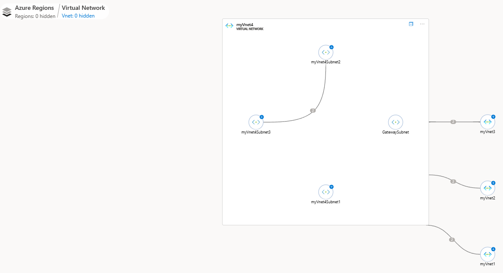
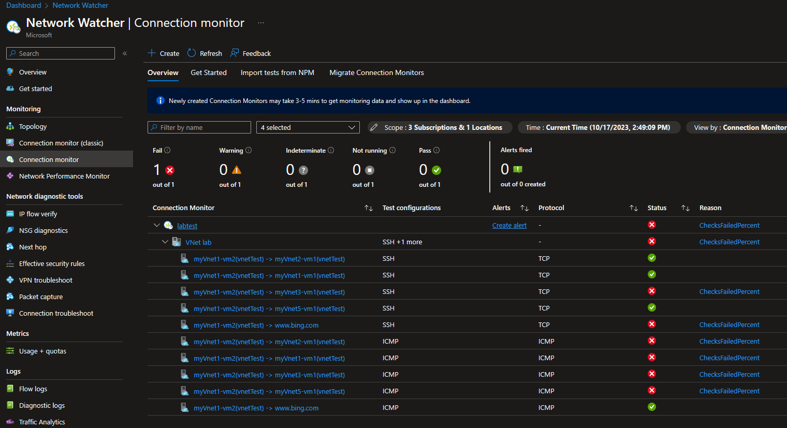
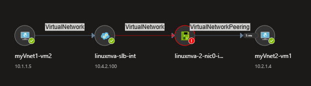
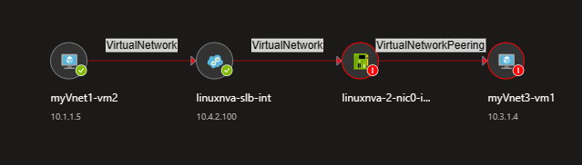

# Azure Networking Lab - Monitoring

Network management and monitoring is a complex discipline. The tools for network monitoring in the public cloud are very different to what network administrators know from the onprem world, so it is not trivial knowing which tool to use in which case. This Azure networking lab presents a good number of challenges where you will need monitoring and troubleshooting skills that will be relevant for any production environment.

This document will present those tools in the context of the lab environment deployed following the instructions in the [README.md](./README.md) file.

## Azure Resource Topology

There are plenty of ways to explore your Azure resources. In this lab we used the Azure CLI, but you can use the Azure portal too. One interesting way of exploring resources is using the Azure Resource Topology, part of Azure Network Watcher. For example, this view shows the subnets in the hub VNet, the number of NICs existing in each subnet, and the VNets peered to it (the spokes):

## Connection Monitor

Both across this lab and in your production network you will need to keep track of which virtual machine has connectivity to which other. In most cases you want to provide connectivity, but in certain cases you want to make sure that certain flows are not possible. For example, if a firewall should filter them out.

Azure Connection Monitor, part of Network Watcher, is a tool that can help you do that: you can define sources, destinations and protocols, and synthetic traffic will be generated that you can use to verify if connectivity is what you expect it to be.

For example, the previous screenshot shows the relevant connectivity for the lab, where the jump host VM (`myVnet1-vm2`) generates traffic to the other virtual machines in the environment using two protocols: ICMP and TCP port 22. We want TCP traffic to work, but we want ICMP traffic not to, since it should be blocked by the firewall appliances. Should ICMP traffic work, that would be an indication that an incorrect routing configuration is causing some traffic to bypass the firewall.

Looking at the previous screenshot, there are some interesting conclusions you can take:

- Most ICMP traffic is not working. The exception is ICMP to the external world, so we might want to make sure that outbound traffic is indeed going through the firewall, and that the firewall is configured to drop it.
- Most SSH traffic is working. One notable exception is SSH between Vnet1 and VNet3.

### Connection Monitor - Topology

Let's have a deeper look at the connectivity. First, we can have a look at how it should work, looking at the SSH test topology between VNet1 and VNet2:

Now we can have a look at the topology for the failed communication:

