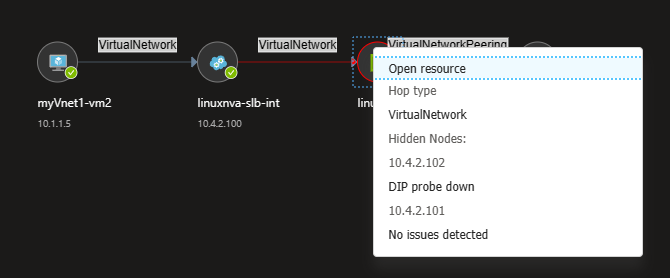
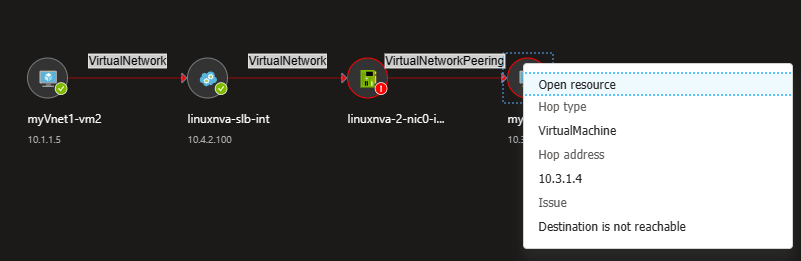
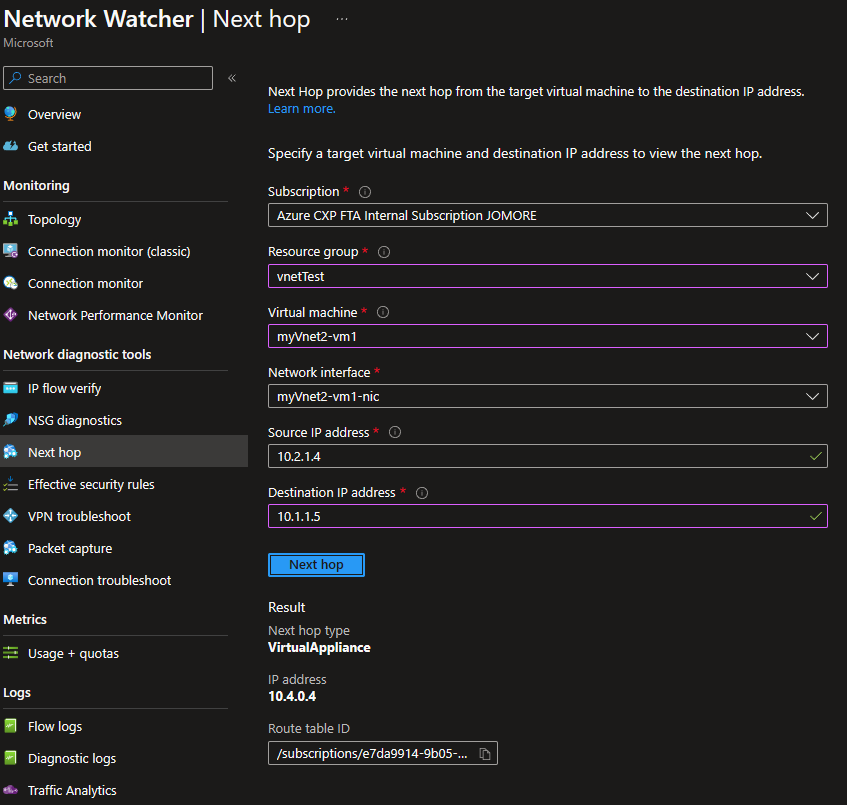
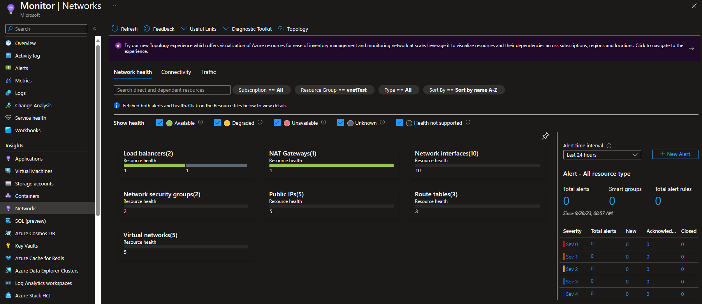
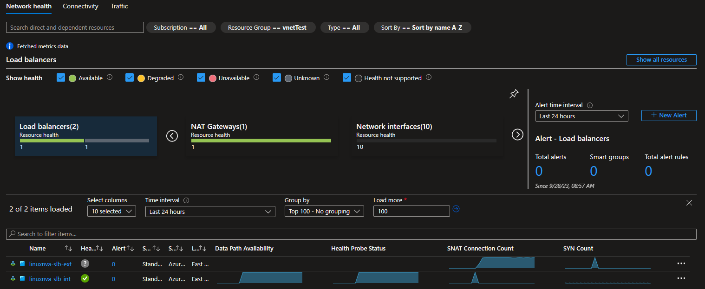
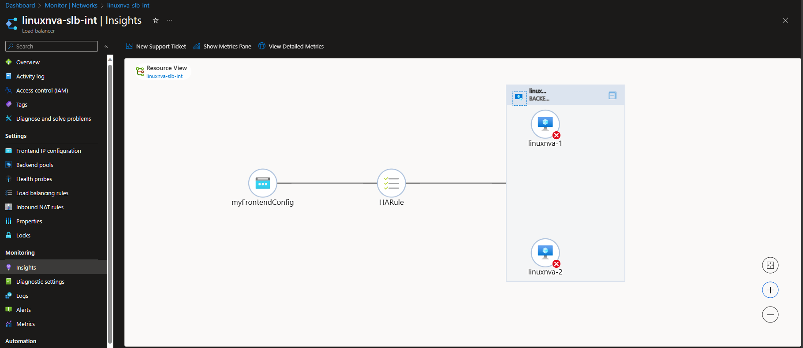
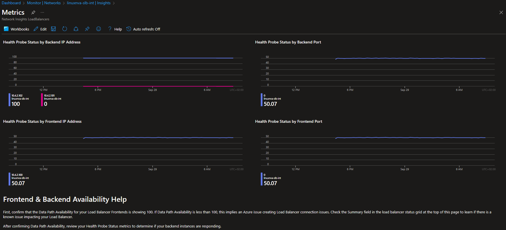
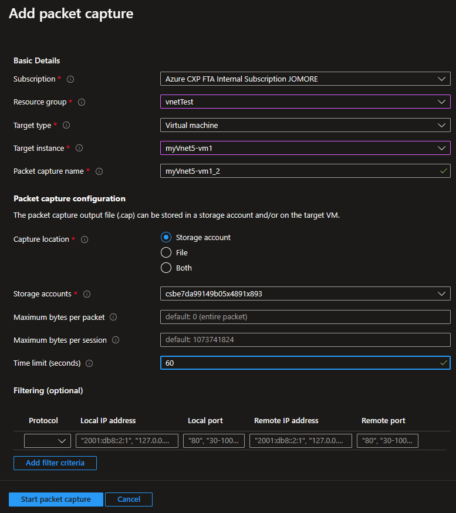

# Azure Networking Lab - Monitoring

Network management and monitoring is a complex discipline. The tools for network monitoring in the public cloud are very different to what network administrators know from the onprem world, so it is not trivial knowing which tool to use in which case. This Azure networking lab presents a good number of challenges where you will need monitoring and troubleshooting skills that will be relevant for any production environment.

This document will present those tools in the context of the lab environment deployed following the instructions in the [README.md](./README.md) file.

## Azure Resource Topology

There are plenty of ways to explore your Azure resources. In this lab we used the Azure CLI, but you can use the Azure portal too. One interesting way of exploring resources is using the Azure Resource Topology, part of Azure Network Watcher. For example, this view shows the subnets in the hub VNet, the number of NICs existing in each subnet, and the VNets peered to it (the spokes):

## Connection Monitor

Both across this lab and in your production network you will need to keep track of which virtual machine has connectivity to which other. In most cases you want to provide connectivity, but in certain cases you want to make sure that certain flows are not possible. For example, if a firewall should filter them out.

Azure Connection Monitor, part of Network Watcher, is a tool that can help you do that: you can define sources, destinations and protocols, and synthetic traffic will be generated that you can use to verify if connectivity is what you expect it to be.

For example, the previous screenshot shows the relevant connectivity for the lab, where the jump host VM (`myVnet1-vm2`) generates traffic to the other virtual machines in the environment using two protocols: ICMP and TCP port 22. We want TCP traffic to work, but we want ICMP traffic not to, since it should be blocked by the firewall appliances. Should ICMP traffic work, that would be an indication that an incorrect routing configuration is causing some traffic to bypass the firewall.

Looking at the previous screenshot, there are some interesting conclusions you can take:

- Most ICMP traffic is not working. The exception is ICMP to the external world, so we might want to make sure that outbound traffic is indeed going through the firewall, and that the firewall is configured to drop it.
- Most SSH traffic is working. One notable exception is SSH between Vnet1 and VNet3.

### Connection Monitor - Topology

Let's have a deeper look at the connectivity. First, we can have a look at how it should work, looking at the SSH test topology between VNet1 and VNet2:

Even if the linux NVA NIC is marked red, opening the context menu reveals that there are no issues with it:

Now we can have a look at the topology for the failed communication:

Now the context menu in the VM will indeed reveal the issue "Destination is not reachable", which seems to indicate a routing problem:

## Next Hop

Following up from the next section, the problem seems to be routing, so you would probably want to check the routing back from the destination to the source (the topology seems to indicate that routing forward is fine). The **Next Hop** tool of Network Watcher allows to do that:

Looking at the previous screenshot, it is apparent that the next hop for the return traffic is not `10.4.2.100`, as the Connection Monitor topology was showing, which explains the problem. You can now go and fix the routing table for VNet3 (you even find the resource ID for the route table in the output, even though a link would have been better).

## Network Insights

If you want to have a quick look at your assets and verify that all are running smoothly, Network Insights (reachable in one of Azure Monitor's blades) is what you are looking for. The following example shows a description of part of the lab (you can set the scope of Network Insights to a specific resource group), where one of the load balancers is not fully healthy:

You can drill into the load balancer section, which will take you to another page where you can see further details about each of the load balancers and NAT gateways that you have deployed. The graphs at the bottom of the screen display useful details that can help you decide where to investigate further:

## Load Balancer Insights

You can click of one of the load balancers of the previous section, which will take you to the main control page for that particular resource. Load Balancers have a very useful Insights blade as well, that show different things from the topology of the machines connected to that particular load balancers to multiple metrics charted together for easy correlation of events.

Here some sample screenshots, that indicate that one of the backends of this particular load balancer is not answering to the health checks:

## Packet capture

It is very useful logging into a virtual machine and initiate a packet capture with Wireshark or `tcpdump`, but sometimes you don't have access to the OS of the virtual machine in question, or you don't want to bother with the installation of new packages. You can use Network Watcher's **Packet Capture** to capture traffic right from the Azure Portal, and store the results in a storage account.

There are multiple options you can define, in this example we want to look into traffic that one of our virtual machines (in VNet5) is seeing. You can create a packet capture restricted to a number of seconds or packets:

You will get your packet capture stored in an Azure Storage Account, that you can easily download and analyze locally, for example with Wireshark:

